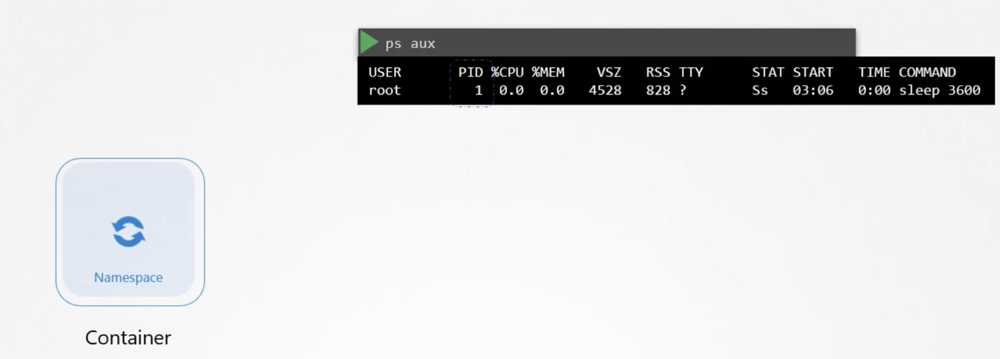
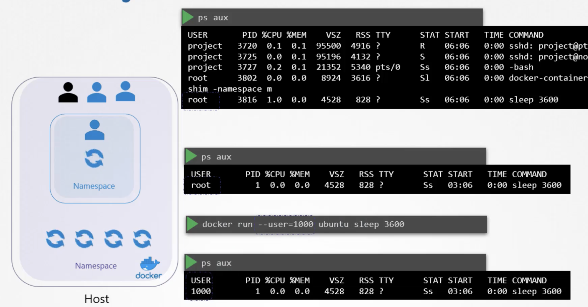
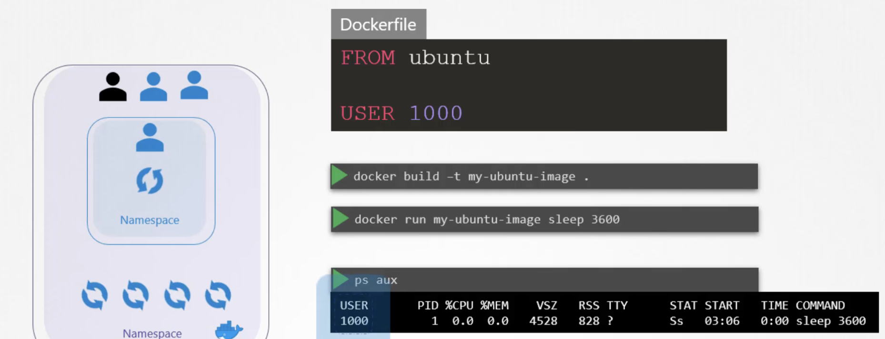
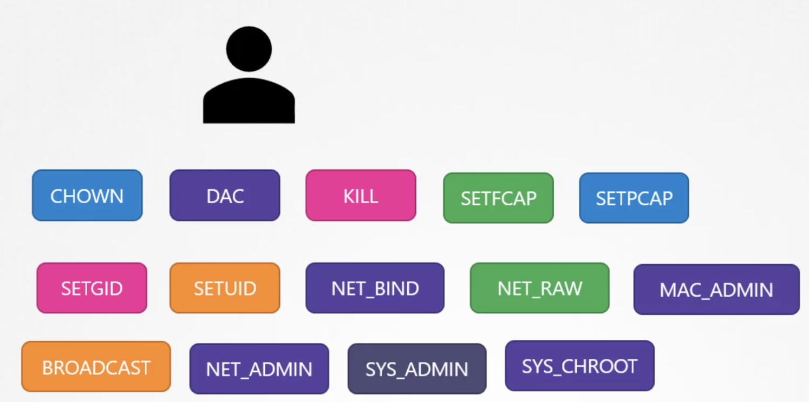
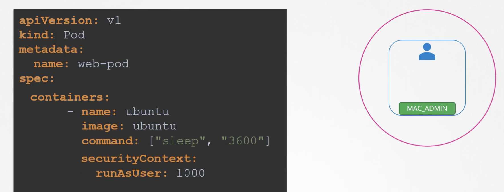

# Security in Docker

It is important to have some knowledge about security in Docker.

Let us start with a host with Docker installed on it.
The host has a set of its own processes running, such as a number of operating system processes, the docker-daemon itself, the SSH server, etc.

Unlike VMs, containers aren't completely isolated from their host. Containers and the host share the same kernel. 

Containers are isolated using namespaces in linux. The host has a namespace and the containers have their own namespace.

When there is container running a process that sleeps for one hour, when we list the processes on the host we will only see one process.

However, when we run the command `ps aux` on the host, we can see all the processes running on the host, including the processes running in the container. This is because the processes can have different process IDs in different namespaces. This is how Docker isolates containers within a system (process isolation).

# Security with Users
By default the containers run as root both within the container and outside the container on the host.

However, to set the user in the container, we can use the `USER` instruction in the Dockerfile. This will run the container as the specified user, thus reducing the risk of running the container as root.

## Risk of Running as Root
If we run the containers as root, isn't that a security risk? Yes, it is. If an attacker gains access to the container, they can gain access to the host as well. 

Therefore, docker implements several security mechanisms to prevent this from happening.

The root user has all the capabilities, some of them shown below.

By default, Docker runs a container with a limited set of capabilities. They do not have the privileges to say reboot the host or perform operations that can disrupt the host or other containers running on the same host.

If we want to override this functionality, we can add the `--cap-add` flag to the `docker run` command. This will add the capability to the container.

On the contrary, there also exists `--cap-drop` flag which drops the capability from the container.

# In Kubernetes
Similarly, in kubernetes we can also define the security standards such as the ID of the user that run the containers. 

In kubernetes, containers are encapsulated in pods. We can choose to configure security at the pod or container levels. If we configure it at a pod level, all the containers in the pod will inherit the security settings.

If we configure it on both the container and the pod level, the container settings will override the pod settings. 

To configure security on the container, add a field called security context in the container.

On the contrary, to configure security on the pod level, we can move the whole security context under containers level.

