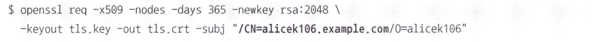
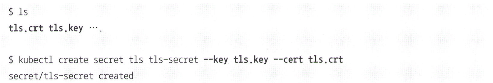
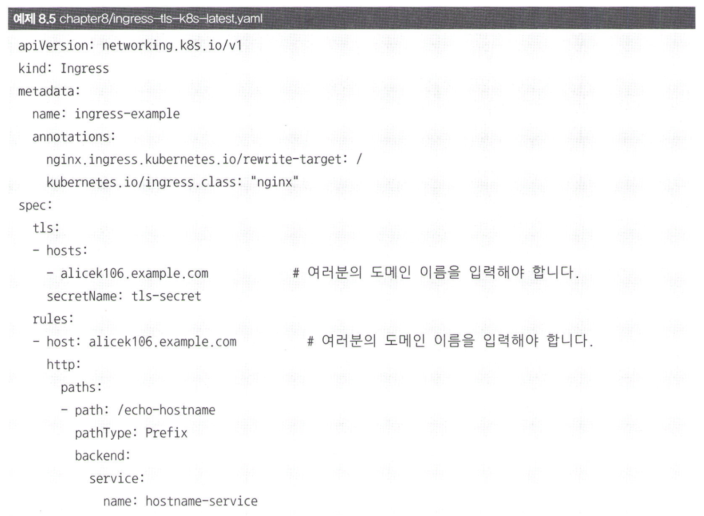
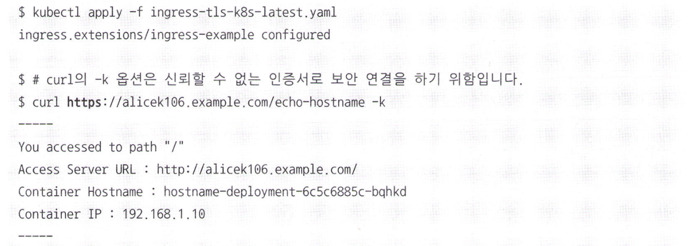
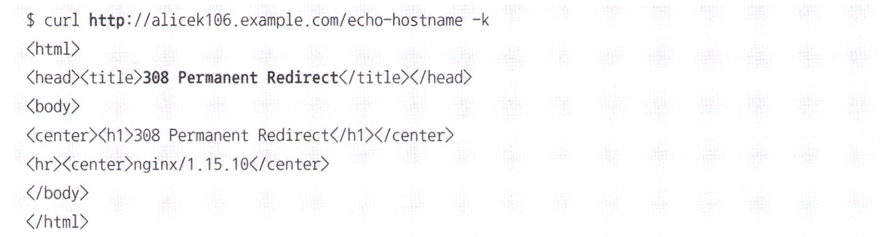

# Nginx 인그레스 컨트롤러에 SSL/TLS 보안 연결 적용

인그레스의 장점 중 하나는 쿠버네티스의 뒤쪽에 있는 디플로이먼트와 서비스가 아닌, 앞쪽에 있는 인그레스 컨트롤러에서 편리하게 SSL/TLS 보안 연결을 설정할 수 있다는 것이다.

즉, 인그레스 컨트롤러 지점에서 인증서를 적용해 두면 요청이 전달되는 애플리케이션에 대해 모두 인증서 처리를 할 수 있다.

따라서, 인그레스 컨트롤러가 일종의 게이트웨이 역할을 하게 된다.

### 인증서를 통한 보안 연결
Nginx 인그레스 컨트롤러는 인증서를 통한 보안 연결 기능을 제공한다.

`연결에 사용될 인증서와 비밀키를 생성`

위 명령어로부터 tls.key와 tls.crt 파일이 생성된다.

- /CN에는 인그레스 컨트롤러에 접근하기 위한 Public DNS 이름을 입력한다.

`tls 타입의 시크릿 생성`

이어서, yaml 파일에 tls 옵션을 추가한다.

- tls.hosts에는 보안 연결을 적용할 도메인 이름을 입력한다.
- tls.secretName에는 tls 타입의 시크릿 이름을 입력한다.

즉, alice106.example.com 도메인 이름으로 접근하는 요청에 대해 tls-secret 시크릿의 인증서로 보안 연결을 수립하겠다는 뜻이다.

`인그레스 생성 뒤, Nginx 인그레스 컨트롤러로 요청`

https로 접근했을 때에도 정상적으로 응답이 오는 것을 확인할 수 있다. 단, 인증서를 통해 보안 연결을 설정했을 때는 http로 접근해도 자동으로 https로 리다이렉트 된다. 이는 특정 인그레스에 SSL/TLS가 적용했을 때, Nginx 인그레스 컨트롤러가 https로 리다이렉트하는 주석 기능인 ssl-redirect를 자동으로 true로 설정하기 때문이다.

`http로 접근해도 https로 리다이렉트`

# 꼬리질문
- SSL/TLS을 설명해보세요.
- 게이트웨이란 무엇이고 무슨 종류가 있나요?
- openssl은 무엇인가요?
- rsa 알고리즘은 무엇인가요?
- DNS는 무엇인가요?
- 308 코드는 무엇을 의미하나요?
- http와 https의 차이점은 무엇인가요?
- 인증서는 무엇이고 어떻게 발급받나요?