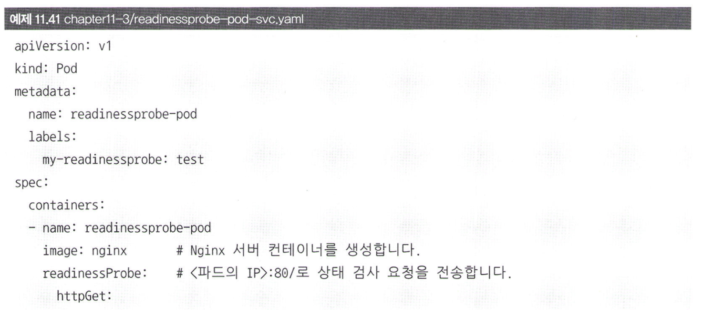

# 11.3.2. 파드의 생애 주기(Lifecycle)

Deployment를 이용해 새로운 버전의 어플리케이션으로 롤링 업데이트를 진행할 때, 기존 파드가 정상적으로 종료되었느지, 새로운 파드는 준비되었는지 등 확인하는 것이 중요합니다. 

그러지 않을 경우, 사용자의 요청이 제대로 처리되지 않은 상태에서 파드가 종료되는 불상사가 일어날 수 있기 때문입니다.

이를 위해 k8s는 파드가 시작할 때 애플리케이션이 준비됐는지 확이하거나, 파드가 종료될 때 애플리케이션이 우아하게 종료될 수 있도록 별도의 기능을 지원합니다.

새로운 버전의 어플리케이션으로 배포 할 경우 알아야 할 파드의 lifecycle에 대한 설명과 어플리케이션의 상태 검사를 위한 livenessProbe, readinessProbe, startupProbe에 대해 알아보겠습니다.

## 11.3.2.1 파드의 상태와 생애 주기
생우주기 (lifecycle)이라는 말이 어렵게 느껴질 수 있겠지만, 지금까지 pod를 할때 나타난 STATUS라고 생각하면 편합니다. 흔한 상태는 다음과 같습니다.
- Pending: Pod 생성 요청이 API에서 승인 되었으나, 아직 Pod가 생성되지 않은 상태
- Running: Pod가 정상적으로 실행 중인 상태
- Completed: Pod가 실행을 완료한 상태
- Error: Pod가 실행 중에 오류가 발생한 상태. 정상적으로 실행되지 않은채로 종료된 상태
- Terminating: Pod가 삭제 중인 상태

애플리케이션을 배포할 때 중요한 상태는 Running과 Terminating 상태입니다. 사용자의 요청은 Running 상태의 Pod에만 전달되고 Terminated 상태의 Pod는 사용자의 요청을 처리할 수 없기 때문입니다.

### Completed, Error, restartPolicy
- 함수가 종료되면 특정 값을 반환(return)하듯이 리눅스의 프로세스 또한 종료될 때 종료 코드를 반환합니다.
- 이처럼, Pod가 종료될 때도 컨테이너의 init 프로세스가 어떠한 값을 반환하는지에 따라 Pod의 상태가 Completed 또는 Error로 설정됩니다.
  
**TMI**  
init 프로세스는 리눅스 시스템이 구동될 때 가장 먼저 실행되는 프로세스로, PID(Process ID)가 1번인 프로세스입니다.

### Completed 상태 Pod
아래는 Completed 상태의 Pod를 생성하는 예시입니다. 해당 YAML 파일에서는 10초 동안 대기한 뒤 종료 코드로 0을 반환하고 죽습니다.

Running 상태의 Pod는 정상적으로 실행 중인 상태이며, 0을 종료 코드로 반환한 뒤에서 Completed 상태의 Pod는 정상적으로 종료됩니다. 이후, Pod는 Completed 상태가 된 뒤에도 계속해서 다시 실행됨과 동시에 RESTARTS 횟수 또한 증가합니다. 이는 파드의 재시작 정책(restartPolicy)이 Always로 설정되어 있기 때문입니다. 종료되었을 때 자동으로 재시작되는 정책입니다.

restartPolicy는 이외에도 Never, OnFailure 등이 있습니다. Never는 종료되어도 재시작되지 않는 정책이며, OnFailure는 종료 코드가 0이 아닌 경우에만 재시작되는 정책입니다.  

다음은 restartPolicy가 Never로 설정된 Pod를 생성하는 예시입니다.

Pod가 종료된 뒤에도 다시 재시작하지 않게 되며, Completed 상태에 머무르게 됩니다.
그렇다면, Pod의 컨테이너가 0이 아닌 exit 1을 반환하게 되는지 살펴보겠습니다.

다음을 보면, Pod 종료 코드로 1이 반환됐기 때문에 상태가 Error로 변경됩니다. 

파드가 재시작되는 과정에서 Pod가 너무 많이 실패하여 재시작이 무한정 반복되는 경우가 발생할 수 있습니다. 실패할때마다 일정간격을 두고 재시도하는 간격이 지수 형태로 늘어나게 되는데, 이때 발생하는 상태는 CrashLoopBackOff입니다. 이는 Pod가 계속해서 재시작되는 상태를 의미합니다.

## 11.3.2.2 Running 상태가 되기 위한 조건
파드가 Running 상태일 때를 바람직한 상태로 파드의 컨테이너들이 정상적으로 생성됐다는 것을 의미하기 때문입니다.  
그러나, 무조건 Running 상태라 하여 모든 컨테이너가 정상적으로 실행 중이라고 할 수 없습니다.

파드를 생성하기 위해 위 기능들을 반드시 사용해야 하는 것은 아니지만, 다음 기능들을 사용하면 파드의 상태를 더욱 정확하게 파악할 수 있습니다.

- Init Container
- postStart
- livenessProbe, readinessProbe

### Running 상태가 되기 위한 조건 - Init Container
Init Container는 파드의 컨테이너 내부에서 애플리케이션이 실행되기 전에 초기화를 수행하는 컨테이너입니다. 파드의 애플리케이션 컨테이너와 동일하게 사용할 수 있지만 이보다 먼저 실행됩니다. 따라서, 애플리케이션 컨테이너가 실행되기 전에 특정 작업을 미리 수행하도록 할 수 있습니다.

다음과 같이 별도의 항복에 정의해 사용할 수 있습니다. 아래 YAML 파일은 initContainers 항목에 정의한 컨테이너가 먼저 실행한 뒤, containers 항목에 정의한 컨테이너가 실행됩니다.

이때, initContainer가 하나라도 실패하면 다음과 같이 애플리케이션 컨테이너는 실행되지 않습니다.

아래 YAML 파일은 다른 서비스 또는 deployment가 생성될 때까지 initContainer에서 대기하는 예시입니다.

### Running 상태가 되기 위한 조건 - postStart
파드의 컨테이너가 실행되거나 삭제될 때 특정 작업을 수행하도록 lifecycle 훅 (hook)을 사용할 수 있습니다. 

훅에는 종류가 두 가지이며 preStop와 postStart입니다. 

- preStop: 컨테이너가 종료되기 전에 실행되는 훅
- postStart: 컨테이너가 실행된 후에 실행되는 훅

**postStart**
postStart는 두 가지 방식으로 사용할 수 있습니다.
- HTTP: 컨테이너가 시작한 직후, 특정 주소로 HTTP 요청을 전송
- Exec: 컨테이너가 시작한 직후, 특정 명령어를 실행

아래 YAML 파일에서는 postStart 훅을 사용해 명령어를 설정했기 때문에 컨테이너가 실행된 직후에 명령어가 실행됩니다.

## 11.3.2.3 애플리케이션의 상태 검사 - livenessProbe, readinessProbe, startupProbe
Init 컨테이너나 postStart가 정상적으로 실행했다 해서 애플리케이션이 정상적으로 실행 중이라고 할 수 없습니다. 다른 이유로 사용자의 요청을 처리할 수 없는 상태가 될 수 있기 때문입니다.

k8s는 애플리케이션이 사용자의 요청을 처리할 수 있는 상태인지 확인하기 위해 livenessProbe, readinessProbe, startupProbe를 제공합니다.
- livenessProbe: 애플리케이션이 정상적으로 살아있는지(liveness) 확인
- readinessProbe: 애플리케이션이 사용자의 요청을 처리할 준비가 되었는지(readiness) 확인
- startupProbe: 애플리케이션이 시작되었는지(startup) 확인

livenessProbe는 애플리케이션이 정상 상태인지 검사하는 기능이며, readinessProbe는 애플리케이션이 시작된 뒤 초기화 작업이 마무리되어 준비가 됐는지(readiness) 검사하는 것이 목적입니다.

livenessProbe 검사에 실패했다는 것은 애플리케이션 내부에서 뭔가 문제가 생겼다는 것이기 때문에 정상 상태로 되돌리기 위해 컨테이너를 재시작하지만 readinessProbe는 그렇지 않습니다.

반면, startupProbe는 위 두 개의 probe와 약간 다른 특성을 갖고 있습니다. startupProbe를 사용할 경우 startupProbe가 성공해야만 livenessProbe와 readinessProbe가 실행됩니다.

### livenessProbe로 애플리케이션의 상태 검사
livenessProbe 기능을 테스트해보기 위해 간단한 예시 파드를 생성해보겠습니다.

컨테이너의 내부 항목에 livenessProbe를 정의했으며, httpGet에 경로와 포트를 지정했습니다. 

- httpGet: HTTP 요청을 전송해 상태를 검사
- exec: 컨테이너 내부에서 명령어를 실행해 상태를 검사
- tcpSocket: TCP 연결이 수립될 수 있는지 체크함으로써 상태를 검사

이 파드를 생성하면 주기적으로 파드의 IP로 HTTP 요청을 전송함으로써 상태 검사를 수행할 것입니다.

Nginx 서버는 기본적으로 80번 포트를 사용하므로 상태 검사가 문제없이 통과했을텐데, 이번에는 이부러 index.html 파일을 삭제하여 livenessProbe가 실패하도록 해보겠습니다.

### readinessProbe로 애플리케이션의 상태 검사
readinessProbe는 아직 준비되지 않은 파드의 애플리케이션이 사용자의 요청을 받아들이지 않도록 하는 기능입니다.

readinessProbe 상태 검사에 실패했더라도 시간이 지나면 다시 성공할 수 있습니다. 

readinessProbe의 세부 옵션은 livenessProbe와 동일하며, httpGet을 통해 <파드IP>:80에서 상태 검사를 수행하도록 설정했습니다.

엔드포인트 리소스의 목록을 확인해 보면 서비스로 접근하는 요청이 파드의 IP로 라우팅되고 있음을 알 수 있습니다.

### livenessProbe와 readinessProbe의 세부옵션
필요하다면 livenessProbe와 readinessProbe의 세부 옵션을 설정할 수 있습니다.

- periodSeconds: 상태 검사를 수행하는 주기 설정. 기본값은 10초
- initDelaySeconds: 컨테이너가 시작된 후 상태 검사를 수행하기 전 대기하는 시간 설정. 기본값은 0초
- timeoutSeconds: 상태 검사 요청에 대한 응답을 기다리는 시간 설정. 기본값은 1초
- successThreshold: 성공으로 간주하는 상태 검사의 연속 횟수 설정. 기본값은 1
- failureThreshold: 실패로 간주하는 상태 검사의 연속 횟수 설정. 기본값은 3

