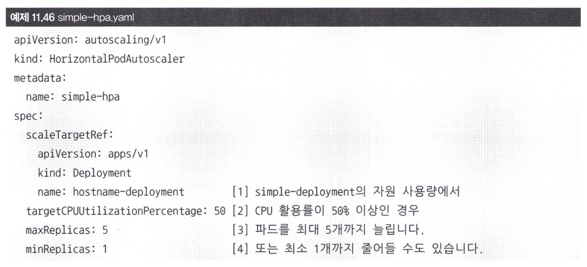
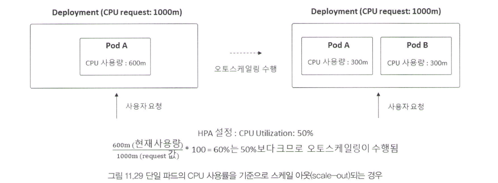
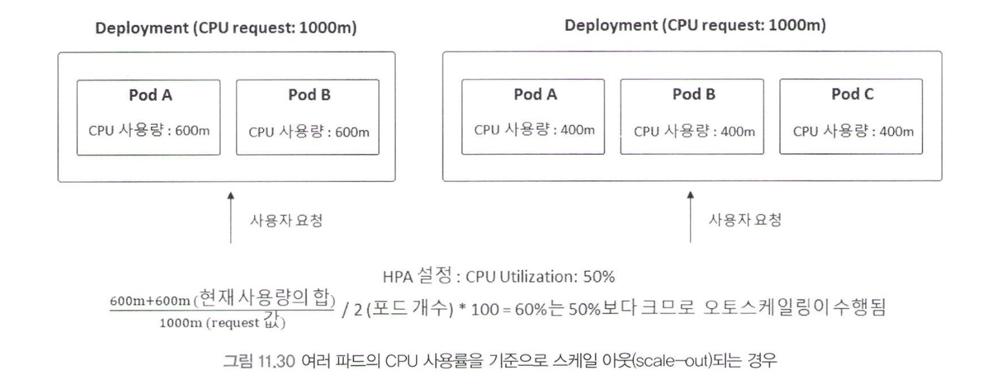
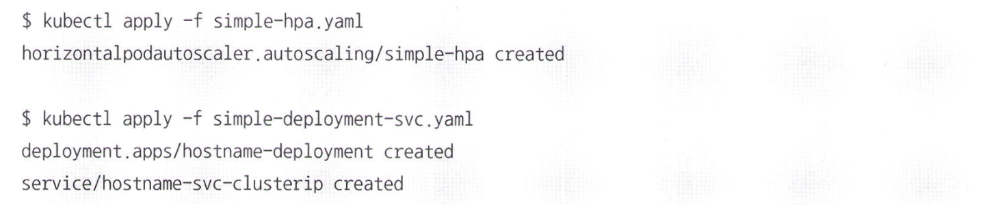
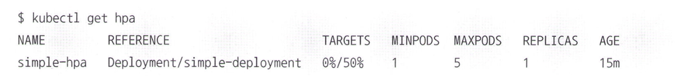
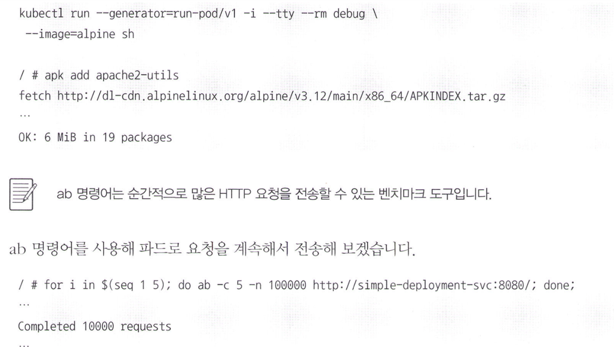
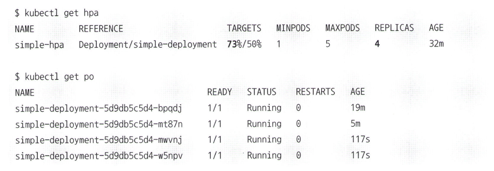

# 11.3.3 HPA를 활용한 오토스케일링

사용자의 요청을 처리할 때에 있어서 서버의 갯수를 고정해놓으면 리소스를 낭비하게 되며, 부하가 많아지면 서버가 요청을 모두 처리할 수 없는 불상사가 발생할 수 있습니다.   
이때, 서버의 갯수를 사용량에 따라 deployment의 pod 개수를 자동으로 조절하는 `HPA(Horizontal Pod Autoscaler)` 기능을 제공합니다.

### metrics-server
HPA는 k8s 내장 기능이긴 하지만, 사용하기 위해서는 metrics-server가 필요합니다. 이때, metrics-server는 별도의 리소스 메트릭 수집 도구이며 이게 있어야 HPA가 동작합니다. 해당 장에서는 metrics-server를 설치하여 `kubectl top`명령어가 정상적으로 작동한다는 가정하에 진행됩니다.

### simple-hpa.yaml

이를 살펴보면 `CPU Utilization`이라는 부분이 있는데, CPU 사용량에 따라 pod의 개수를 조절하겠다는 의미입니다.

아래 사진을 보면 현재 사용량이 60%는 50% 이상이므로 pod의 개수를 2개로 늘리는 것을 확인할 수 있습니다.  

이어서 pod가 두개인 경우에도 사용량이 50% 이상이면 pod의 개수를 늘리는 것을 확인할 수 있습니다.

## HPA와 함께 Deployment 생성
HPA가 의도대로 작동하고 있는지 확인하기 위하여 deployment와 함께 생성합니다.

이때, HPA의 목록을 확인해보면 디플로이면트에 속한 파드의 CPU 평균 사용률을 확인할 수 있습니다.   
targets가 0/50%라는 것은 현재 사용량이 0%이며, 50% 이상이면 pod의 개수를 늘리겠다는 의미입니다.

요청을 한번에 많이 보내서 CPU 사용량을 높여보겠습니다. (이때 사용한 도구는 apache benchmark입니다.)

터미널을 열어서 HPA를 확인해보면 pod가 늘어난 것을 확인할 수 있습니다.

- 이때, kube controller는 metrics-server가 제공하는 API로부터 메트릭 정보를 받아오는데, 이는 --horizontal-pod-autoscaler-sync-period 옵션으로 설정할 수 있습니다. 기본값은 15초이며, 이는 15초마다 메트릭 정보를 받아오는 것을 의미합니다.

### HPA가 불필요한 경우
모든 경우에 HPA를 사용하는 것이 좋은 것은 아닙니다. 한가지 예시로 애플리케이션을 초기화할 때 잠시 동안만 CPU를 과도하게 소모하는 JVM 기반 어플리케이션들이 있습니다. 이를 어느 정도 완화하기 위해 주기를 --horizontal-pod-autoscaler-sync-period로 설정할 수 있습니다.

