# 13.3 스테이트풀셋(StatefulSets)

## 스테이트풀셋(StatefulSet) 사용하기
쿠버네티스에서 상태를 갖지 않는 MSA(마이크로 서비스 아키텍처) 구조의 어플리케이션이 동작하는 경우에 이들은 대부분 상태를 갖지 않습니다(Stateless). 그러나, 데이터베이스 어플리케이션 같은 경우에는 상태가 중요해지고, 이를 관리하기 어렵습니다.  

쿠버네티스에서는 이를 해결할 수 없으나, 이를 관리하기 위해 제공되는 오브젝트로 StatefulSet이 있습니다. 이름으로부터 유추 가능하듯, StatefulSet은 상태를 갖는 어플리케이션을 관리하기 위한 오브젝트입니다.

### 쿠버네티스는 Stateful Pod와 Stateless Pod를 어떻게 여기는가?
쿠버네티스는 흔히 상태가 없는 파드는 '가축'에 비교됩니다. 이름이 없으며, 언제나 대체될 수 있으며, 다른 동물들과 구분하지 않기 때문입니다. (예: deployment로부터 생성된 파드) 

반면에, 상태를 갖는 파드는 '애완동물'에 비교됩니다. 이름이 있으며, 쉽게 대체될 수 없으며, 다른 동물들과 구분을 위한 고유 식별자가 있기 때문입니다.  
(예: StatefulSet으로부터 생성된 파드)  

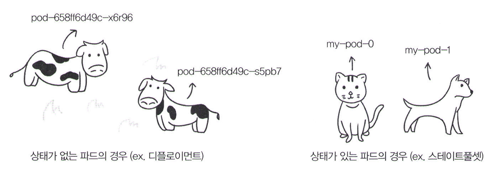

### 스테이트풀셋(StatefulSet) 예시
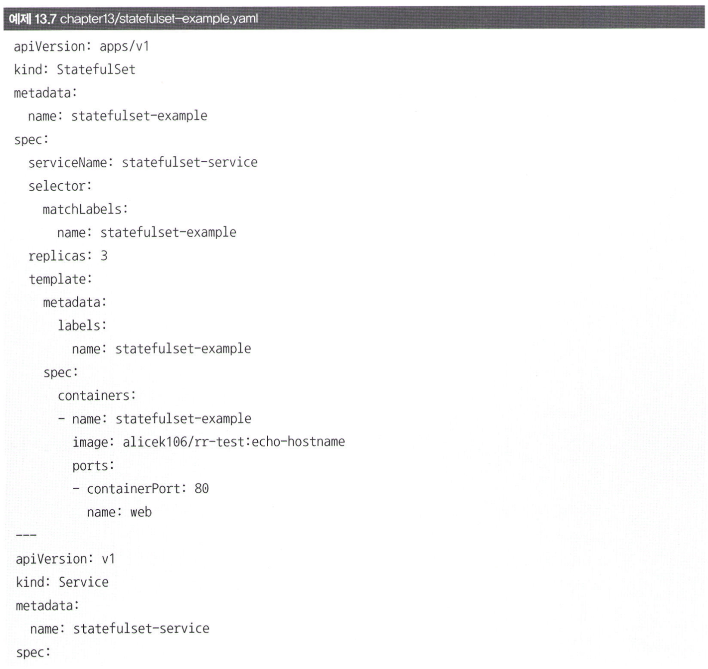
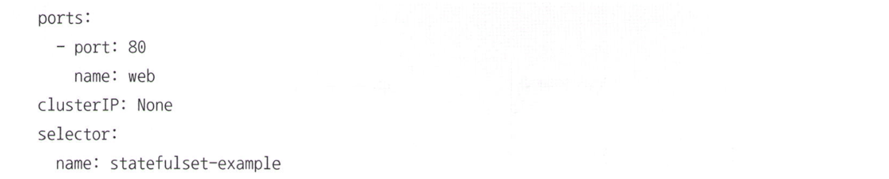

이를 적용하면 1개의 statefulset과(파드 3개) 1개의 서비스가 생성됩니다.

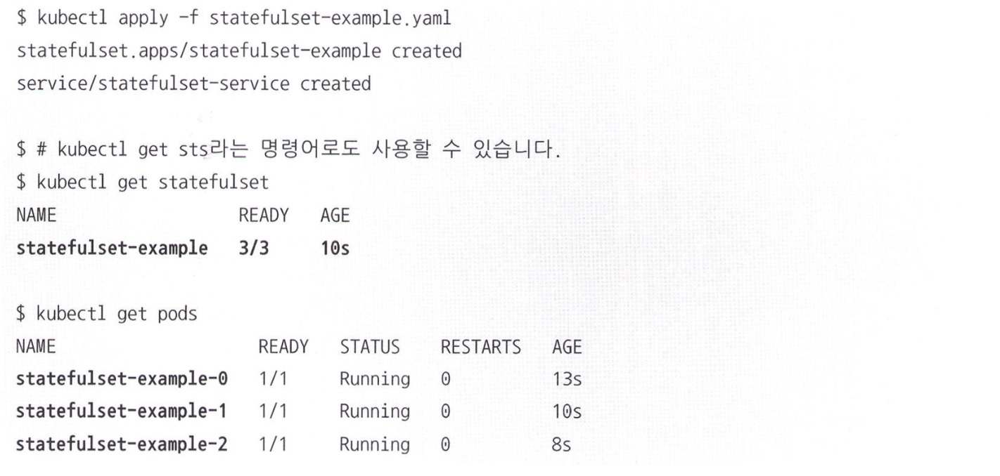

이때 살펴보면, deployment로부터 생성된 파드들은 이름들이 랜덤한 이름들이 생성되지만, statefulset으로부터 생성된 파드들은 이름이 순차적으로 생성됩니다. 

다시 돌아가서 yaml 파일을 살펴보면 처음으로 보는 `spec.serviceName`이라는 항목이 있습니다. 이 항목에는 statefulset의 파드에 접근할 수 있는 서비스 이름을 정의합니다. 왜 굳이 statefulSet에만 이런게 있을까요?  

### serviceName
일반적인 서비스를 statefulSet에 사용하면 어떻게 될까요? 서비스는 라벨 셀렉터가 일치하는 랜덤한 파드를 선택해서 트래픽을 전달합니다. 하지만, statefulSet에서는 파드들이 가축이 아니라 애완동물이기 때문에, 랜덤하게 트래픽을 전달하는 것이 아니라, 특정 개별 파드에 트래픽을 전달해야 합니다.

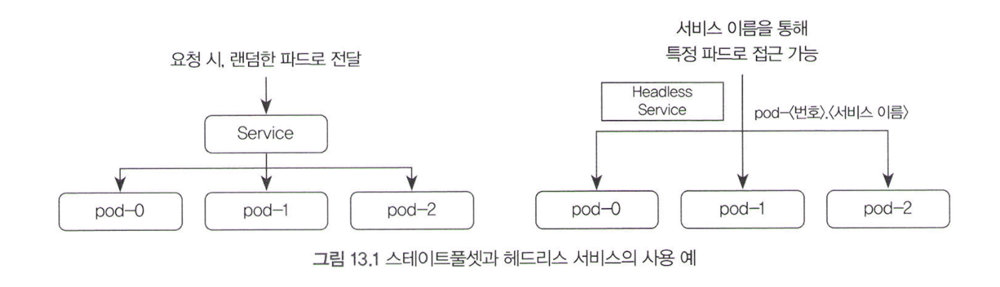   

따라서, 일반적인 서비스가 아니라 Headless 서비스를 사용할 수 있습니다. Headless Service는 서비스의 이름으로 파드의 접근 위치를 알아내기 위해서 사용되며, 이를 위해 `spec.clusterIP: None`으로 설정합니다.

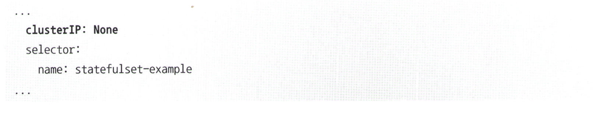  
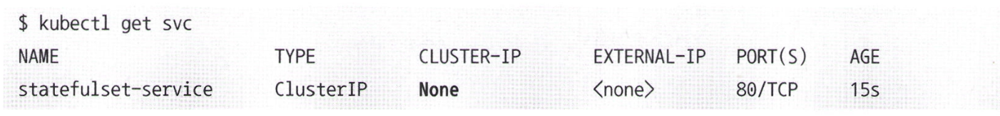  

Headless Service의 이름은 SRV 레코드로 쓰이기 때문에 헤드리스 서비스의 이름을 통해 파드에 접근할 수 있는 IP를 반환할 수 있습니다. 예를 들어, nslookup 명령어에 headless service 이름을 입력하면 접근 가능한 파드의 IP가 출력됩니다.  

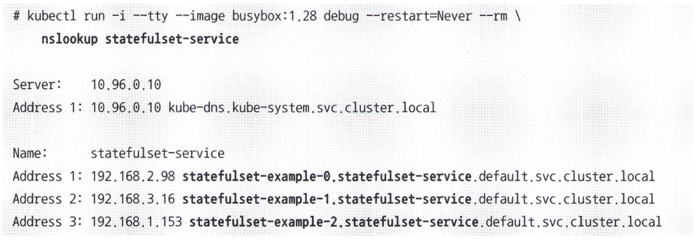
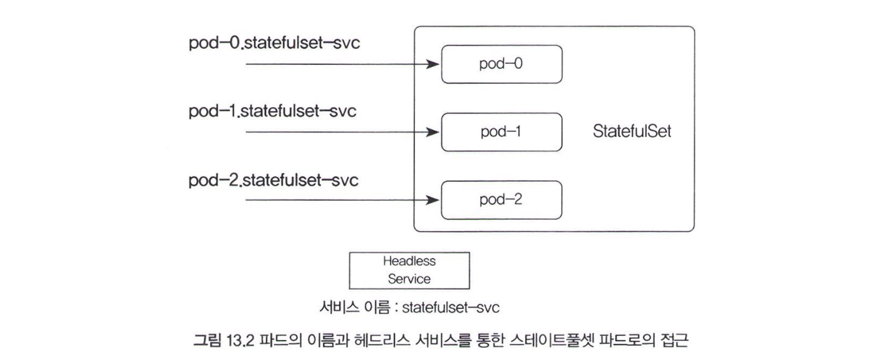

이런 개념은 쿠버네티스 뿐만 아니라 DevOps에서도 자주 등장한다고 하니, StatefulSet의 의도를 이해하면 좋습니다.

## 스테이트풀셋(StatefulSet)과 퍼시스턴트 볼륨(Persistent Volume)

파드의 데이터는 일반적으로 휘발성이기 때문에 파드 내부의 Persistent Volume을 마운트해 데이터를 보존하는 것이 일반적입니다.  

Stateful Set 또한 파드 내부에 데이터가 저장되는, 상태가 존재하는 애플리케이션을 배포하는 것이 일반적이기 때문에, 마찬가지로 PV를 마운트해 데이터를 보관하는 것이 바람직합니다. 그러나, Stateful Set이 여러 개라면 파드마다 PV를 생성해야 하는 번거로움이 존재한다. 다행히, Stateful Set 내부에 파드마다 PV 클레임을 자동으로 생성함으로써 다이나믹 프로비저닝을 지원합니다.

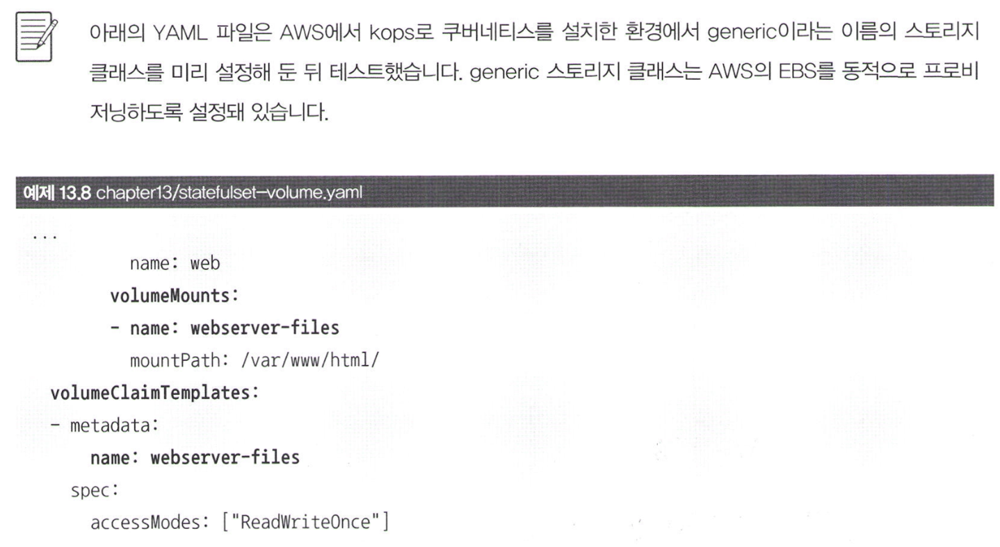
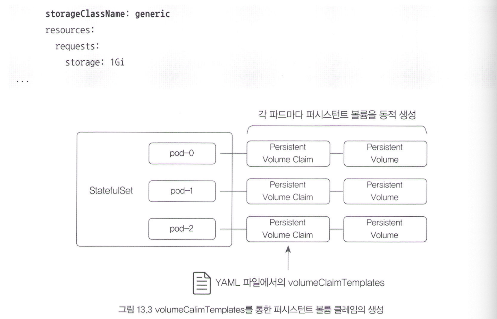

VolumeChainTemplates를 사용하면 Stateful Set의 각 파드에 대해 Persistent Volume Claim이 생성됩니다. Templates라는 단어가 의미하는 것처럼 파드가 사용할 PVC의 템플릿을 정의합니다.  

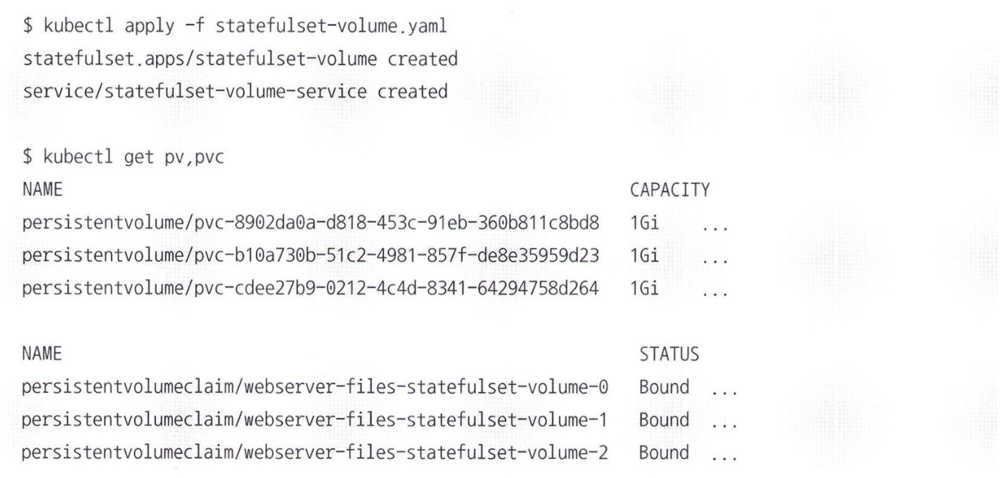

단, Stateful Set을 삭제한다고 해서 volumeClaimTemplates에 정의된 PV가 함께 삭제되지는 않습니다. 파드가 줄어들더라도 기존의 데이터를 보존하기 위해서입니다.  

## 리소스 정리
남아있는 리소스가 있다면 정리.  
`kubectl delete -f ./`