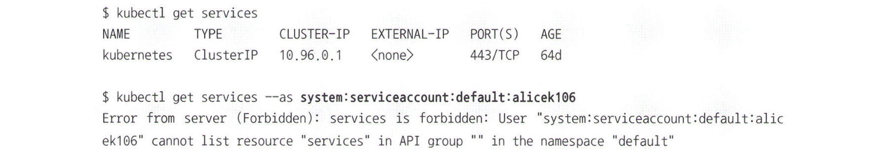
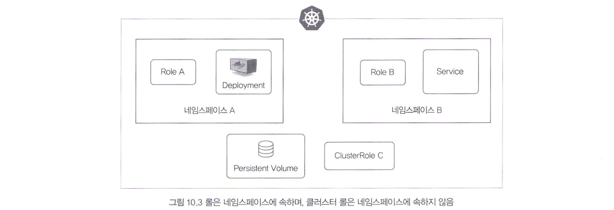
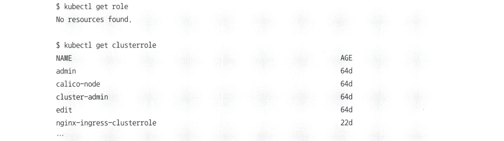
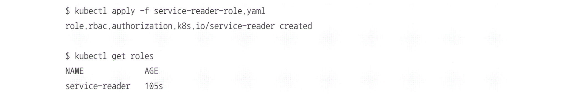
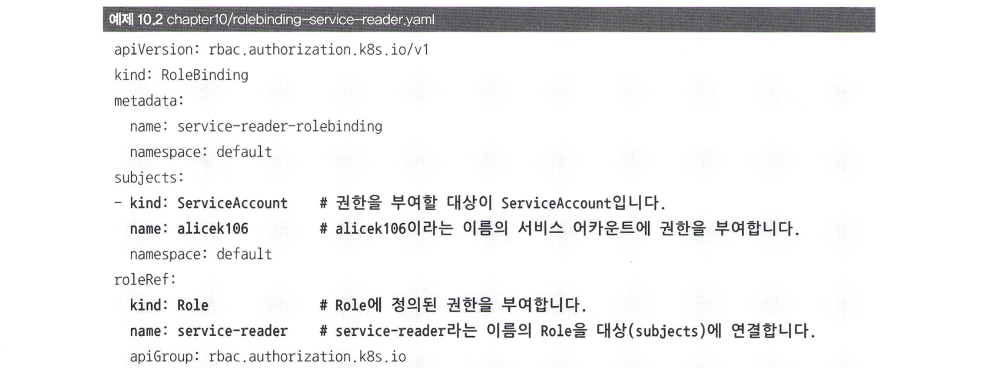
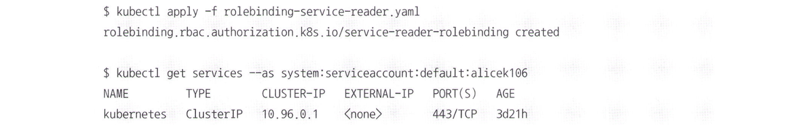
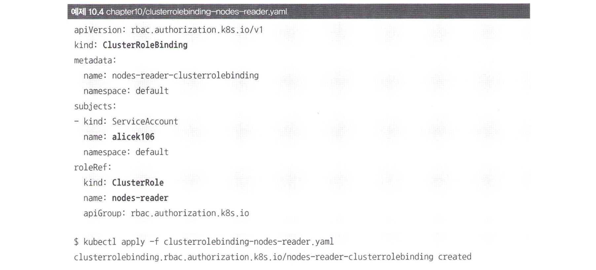
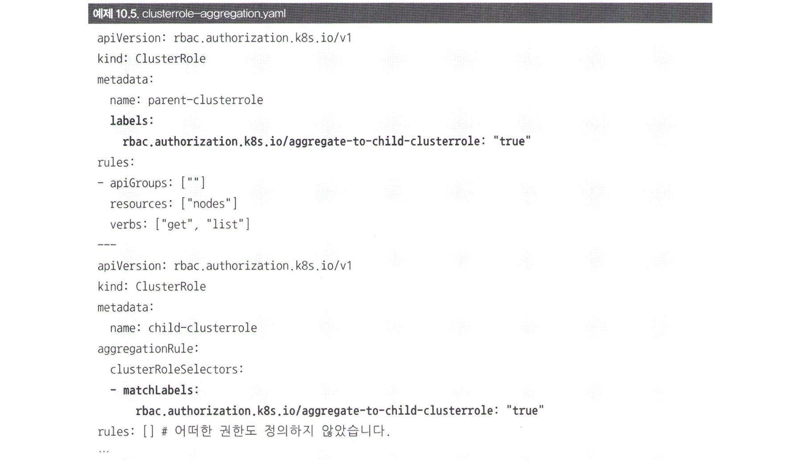
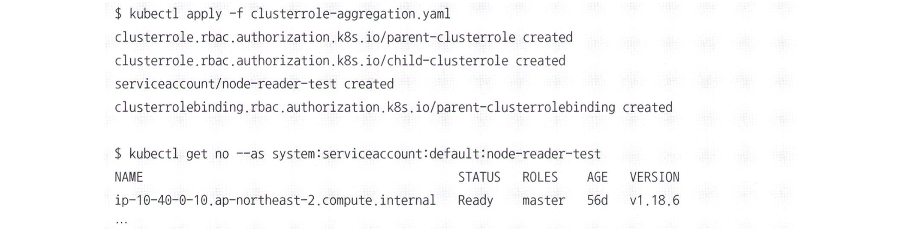

# 10.2 서비스 어카운트와 롤(Role), 클러스터 롤(Cluster Role)

- 서비스 어카운트는 권한을 관리하기 위한 오브젝트입니다. 
- SA 하나는 하나의 유저에 해당한다고 생각하면 편합니다. 
- SA는 namespace에 속하는 오브젝트로, serviceaccount 또는 SA라는 이름으로 사용할 수 있습니다.


SA를 생성하지 않아도 기본적으로 각 namespace에는 default라는 이름의 SA가 존재합니다. 또한, create나 delete으로 쉽게 생성과 삭제를 할 수 있습니다.


### --as 옵션
지금까지는 config 파일의 인증키를 사용했으나, 이제는 SA를 사용해볼 예정이다.

`--as` 옵션을 사용하면 임시로 특정 SA를 사용할 수 있음.

다음을 보면 기본은 config을 사용하기 때문에 root 권한이라 다 뜨지만, 그 다음 SA를 쓰니까 더 이상 조회가 안됨. 당연함. 아직 SA에 권한이 부여되지 않았기 때문. 

`default:alicek106`은 `default` namespace의 `alicek106` SA라는 뜻.



## 권한 부여 방법: 롤, 클러스터 롤

>그렇다면 권한을 부여하는 방법은 무엇이 있을까?

크게 두 가지: 1. 롤(Role)과 2. 클러스터 롤(Cluster Role).   
(롤이라고 하니까 뭔가 맛있는 빵 같지 않나요?)

롤과 클-롤은 부여할 권한이 무엇인지 나타내는 k8s 오브젝트입니다. (오브젝트 참 좋아해요 가만 보면)

다만, 아래와 같이 Role은 namespace에 속해 있으며, Cluster Role은 속해 있지 않음.



- 롤은 namespace 수준의 오브젝트 (예: deployment, service)에 대한 권한을 정의할 때 쓰임.
- Cluster 롤은 Cluster 단위의 권한을 정의할 때 사용. (예: PersistentVolume)



- get role하면 현재 namespace의 롤 목록만 출력
- get clusterrole는 클러스터 자체에 존재하는 모든 클러스터 롤의 목록을 출력합니다.

클러스터 롤은 k8s 컴포넌트가 사용하는 권한도 포함되어 있기 때문에 미리 생성되어 있는 클러스터 롤이 많음.

# Role 사용 예시

**Role yaml 파일**

```yaml
apiVersion: rbac autorization.k8s.io/v1
kind: Role
metadata:
    namespace: default
    name: service-reader
rules:
- apiGroups: [""]           # 1. 대상이 될 오브젝트의 API 그룹
  resources: ["services"]   # 2. 대상이 될 오브젝트의 이름
  verbs: ["get", "list"]    # 3. 어떠한 동작을 허용할 것인지 명시
```

위 YAML 파일은 서비스의 목록을 읽을 수 있는 롤을 정의합니다. metadata 항목의 namespace는 롤이 생성될 네임스페이스를, name은 롤의 이름을 설정했습니다. 

이때 rules 부분은 특히나 중요해서 자세히 살펴봅시다.

## rules

### 1. apiGroups
어떠한 API 그룹에 속하는 오브젝트에 대하 권한을 지정할지 설정합니다. API 그룹은 쿠버네티스의 오브젝트가 가지는 목적에 따라 분류되는 일종의 카테고리. 

`""` : pod, service 등이 포함된 코어 API 그룹을 의미.

### 2. resources
어떤 k8s 오브젝트에 대해 권한을 정의할 것인지 입력. 예: `["services"]`

### 3. verbs
이 롤을 부여받은 대상이 resources에 지정된 오브젝트에 대해 **어떤 동작을 할 수 있는지** 정의.

*이를 적용해보면 다음과 같다:*  


    끝인가? 세상이 그렇게 쉽게 굴러갈리가 없지.
    롤은 특정 기능에 대한 권한만을 정의하기 때문에 롤을 생성한다고 끝이 아니다.
    이 롤을 특정 대상에게 부여하려면 RoleBinding이라는 오브젝트를 통해 특정 대상과 롤을 연결해야 한다.

    예를 들어, ServiceAccount에 Role을 부여하려면 다음과 같이 하면 된다.



어떤 대상을 연결해줄지 RoleBinding에서 정의해준다.

위의 yaml 파일을 보면, `alicek106` 서비스 어카운트가 `service-reader` 롤에 정의된 권한을 사용할 수 있게 된다.

롤 바인딩을 해주고 `get services` 한번 때려보니까 이제 작동한다.  


반면에 허가되지 않은 `get deployment`는 바로 막힌다.


롤은 약간 '허가 범위' 느낌이고 롤 바인딩은 '중간다리/연결고리' 역할을 수행한다.

# 클러스터 롤
그렇다면 namespace를 벗어나는 경우에는 어떨까? `클러스터 롤`을 사용해야 합니다.

다음은 노드의 목록을 조회하기 위한 ClusterRole이다.  


유사하게, ClusterRoleBinding 또한 진행해야 한다.

  

## 여러 개의 클러스터 롤을 조합해서 사용하기

자주 사용하는 클러스터롤이 있다면 다른 클러스터롤에 포함시켜 재사용할 수 있다.   
이걸 롤 애그리게이션 `(aggregation)`이라고 한다. 

### 예제:

다음과 같은 간단한 클러스터 롤이 있다고 가정해보자.

  

이때, 자세히 보시면, `aggregationRule`에 `matchLabels`라는 부분이 있습니다.  
이 부분은 클러스터롤에 포함시키고자 하는 다른 클러스터 롤을 matchLabels의 라벨 셀렉터로 선택하면 하위 클러스터 롤에 포함돼 있는 권한을 그대로 부여받을 수 있습니다.

보면 child-clusterrole은 아무 권한도 없는데, parent-clusterrole을 물려받기 때문에 child-clusterrole에서 nodes에 대하여 nodes에 대한 get/list 권한을 쓸 수 있게 된다.



이렇듯, 클러스터 롤 애그리게이션을 사용하면 여러 개의 클러스터 롤 권한을 하나의 클러스터 롤에 합쳐서 사용할 수도 있으며, 여러 단계의 클러스터 롤 권한 상속 구조를 만들 수도 있습니다. 