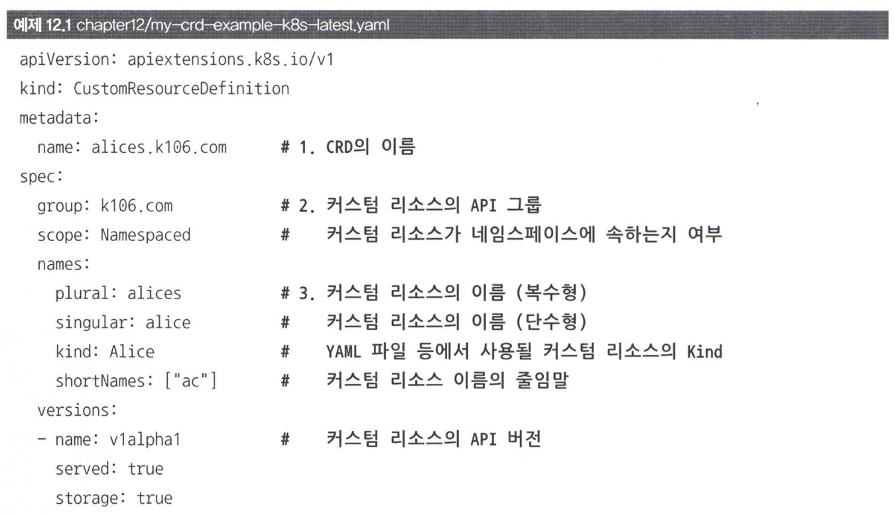
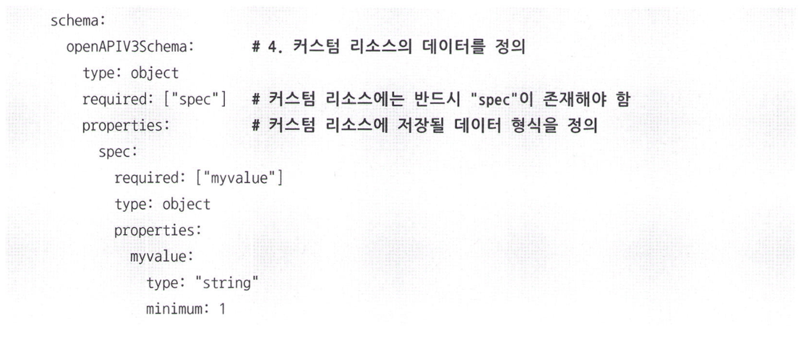
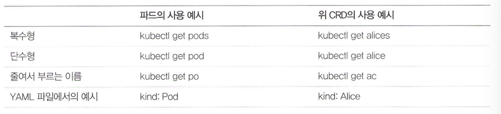
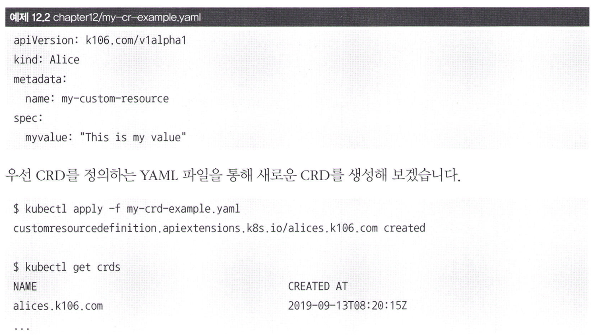
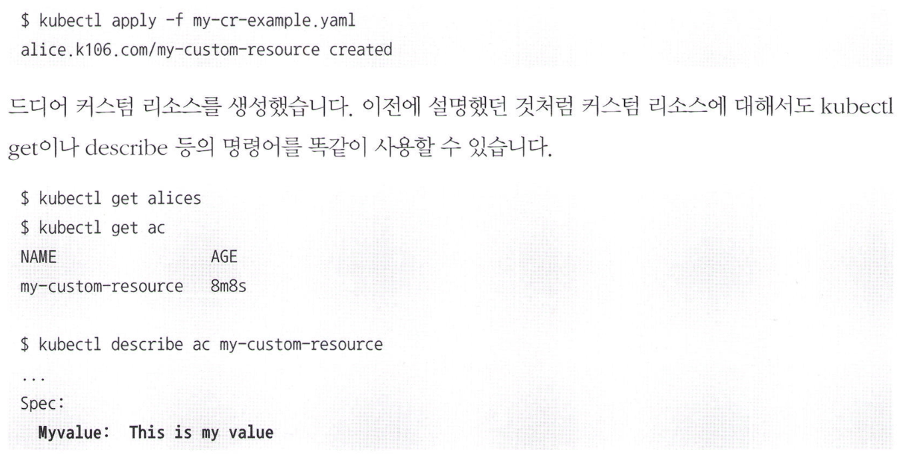

# 12.3 커스텀 리소스를 정의하기 위한 CRD(Custom Resource Definition)

Custom Resource Definition (CRD): k8s '**커스텀 리소스를 정의**'하는 오브젝트

기본적으로 네트워크 플러그인을 위한 커스텀 리소스가 기본적으로 존재합니다.

CRD는 커스텀 리소스를 어떻게 사용할 계획인지 k8s에 등록하는 역할을 합니다. 즉, CRD를 생성하고 이 규격에 맞는 커스텀 리소스를 생성해야 의미를 갖습니다. 

**즉, CRD는 커스텀 리소스와 다르다는 점을 알아야 합니다.**

## CRD yaml 파일 예시:

### 1. metadata.name
CRD의 이름을 정의합니다.
- CRD의 이름은 반드시 spec.names.plural(복수형) + "." + spec.group 형태로 지정해야 합니다.

### 2. spec.group, versions:
- 이 CRD를 통해 생성될 커스텀 리소스의 API 그룹과 버전을 설정.

### 3. spec.names
커스텀 리소스를 지칭할 이름을 설정합니다. plural은 커스텀 리소스의 복수형을, singular은 단수형을 지정합니다.
- kind는 YAML 파일 등에서 Kind 항목에서 커스텀 리소스를 지칭할 때 사용할 이름
- shortNames는 kubectl 명령어에서 사용할 수 있는 축약어를 지정합니다.

### 4. spec.validation
커스텀 리소스에 어떠한 데이터가 저장돼야 하며, 어떠한 항목이 반드시 설정돼야 하는지 정의합니다.

## 커스텀 리소스 YAML 파일:

이렇게 정의된 CRD를 통해 커스텀 리소스를 생성할 수 있습니다.

앞서 작성했던 my-cr-example.yaml 파일로 커스텀 리소스를 생성하면 다음과 같다.

