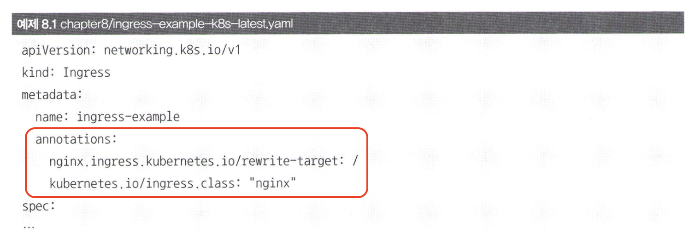
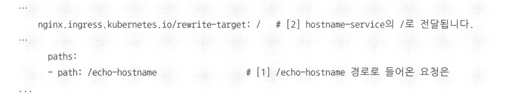
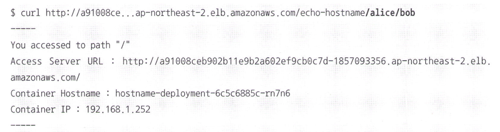
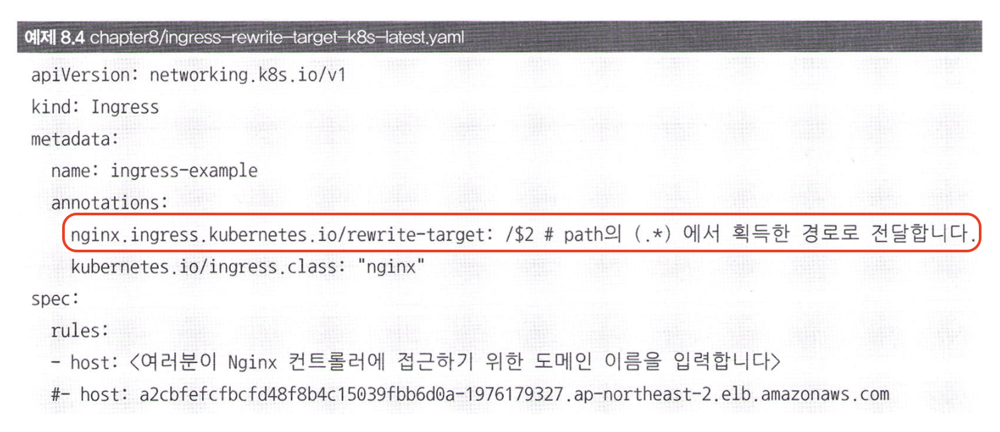
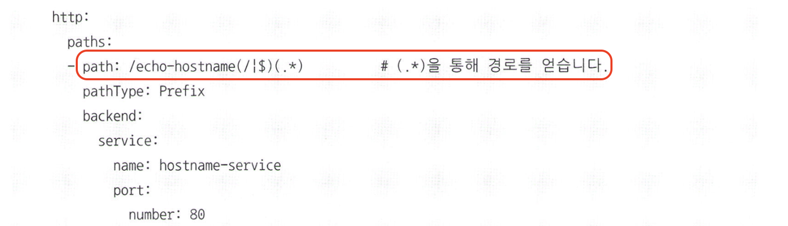
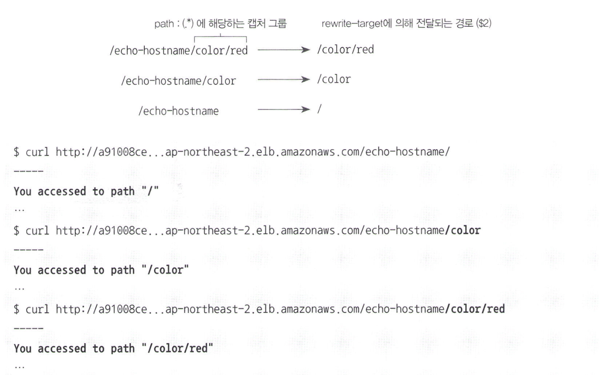

# 인그레스의 세부 기능: annotation을 이용한 설정

인그레스에서는 주석(annotation) 항목을 정의함으로써 세부적인 설정이 가능하다.

### ingress.class
- **kubernetes.io/ingress.class는 해당 인그레스 규칙을 적용할 인그레스 컨트롤러를 지정한다.**
- 클러스터에서 기본적으로 사용하는 인그레스 컨트롤러가 있기 때문에 특정 인그레스 컨트롤러를 사용하고 싶을 때 이 항목을 사용한다.
  - 예: GKE 클러스터에서는 GKE의 인그레스 컨트롤러를 자동으로 생성하므로, nginx라고 명시해줘야 nginx 인그레스 컨트롤러를 사용할 수 있다.

### rewrite-target
- **nginx.ingress.kubernetes.io/rewrite-target는 인그레스에 정의된 경로로 들어오는 요청을 rewrite-target에 설정된 경로로 전달한다.**
  - 예: nginx 인그레스 컨트롤러로 /echo-hostname에 접근하면 hostname-service에는 / 경로로 전달된다.
  - /echo-hostname/alice/bob -> /

### 캡처 그룹
캡처 그룹이란 정규 표현식의 형태로 요청 경로 등의 값을 변수로서 사용할 수 있는 방법이다. 따라서 rewrite-target에 캡처 그룹을 사용하면 요청 경로의 일부를 변수로 사용할 수 있다.

위의 그림에서는 /echo-hostname/alice/bob로 요청이 들어오면 /alice/bob로 전달되도록 설정되어 있다.

(.*)은 /echo-hostname/ 다음에 오는 모든 문자열을 캡처하는 정규 표현식이다. 

