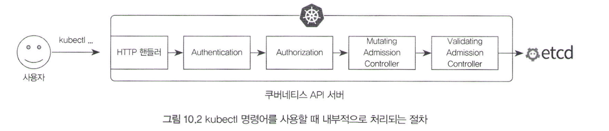

# 10 보안을 위한 인증과 인가: ServiceAccount와 RBAC

여러 개발자와 어플리케이션이 k8s에 동시에 접근해야 할수도 있습니다. 이때, 중요하게 고려해야 하는 부분 중 하나는 **보안입니다.**

보안을 보장하기 위해 k8s에서 흔히 쓰이는 기능 중에는 RBAC (Role Based Access Control)를 기반으로 하는 서비스 어카운트(Service Account)가 있습니다.

Service Account를 간단하게 생각해보면 리눅스에서 root와 user를 나누는것과 유사합니다. 

지금까지 모든 명령어를 k8s의 root에서 진행했으나, 동시에 여러명이 접근해야 한다면 최소한의 권한을 부여하여 주는게 바람직합니다.

따라서, ServiceAccount 및 RBAC를 사용하기 위한 Role(롤), Cluster Role(클러스터 롤) 등을 먼저 사용해본 뒤, 사용자를 추상화한 User(유저) 및 Group(그룹), Open ID Connect(OIDC)에 대해서 알아보겠습니다.

# 10.1 쿠버네티스 권한 인증 과정

k8s에는 다양한 컴포넌트가 존재합니다. 이 중 가장 흔히 접근하는 컴포넌트는 k8s의 API 서버입니다.

지금까지는 kubectl 명령어를 쓸때마다 다음과 같은 복잡한 과정이 진행되었습니다.

1. API서버의 HTTP 핸들러 요청을 전송
2. API 서버는 해당 클라이언트가 쿠버네티스의 사용자가 맞는지 인증(authentication)
3. 해당 기능을 실행할 권한이 있는지 인가(authorization)
4. Admission Controller

그러나 지금까지 이런걸 설정한적이 없기 때문에 의아할 수 있습니다.

그렇다면 이게 어떻게 작동하는 것인가?

미리 자동으로 config파일이라는 곳에 공개키와 비밀키로 인증서가 저장해두었기 때문이다.

