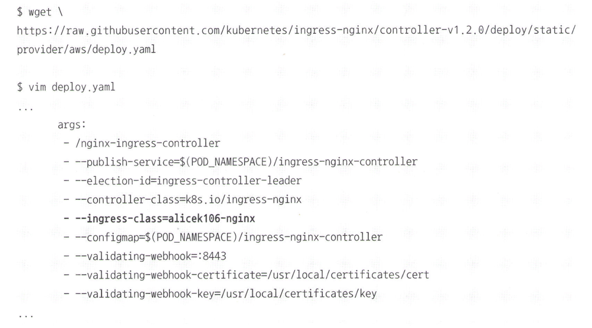
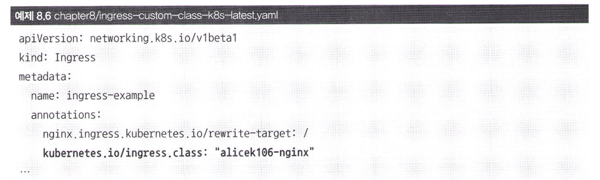

# 여러 개의 인그레스 컨트롤러 사용하기

- 하나의 쿠버네티스 클러스터에 반드시 하나의 인그레스 컨트롤러를 사용해야 하는것은 아니다.
- Nginx 인그레스 컨트롤러는 기본적으로 nginx라는 클래스를 갖고 있지만, 이 설정을 변경해서 여러 개의 인그레스 컨트롤러를 사용할 수 있다.

`--ingress-class 직접 추가`

- --ingress-class 옵션이 이제 nginx가 아닌 alicek106-nginx이기 때문에 이전에 생성했던 인그레스 규칙은 더 이상 nginx 인그레스 컨트롤러에 적용되지 않는다. 
- 따라서, ingress.class를 alicek106-nginx로 지정한 규칙만 alicek106-nginx 인그레스 컨트롤러에 적용된다.

**TMI: 이외에도 --annotations-prefix, --configmap 등의 다양한 옵션이 존재하며, 실제 운영 환경에서는 이런 커스터마이징이 필요할수도 있다고 한다.**

### 남아있는 리소스 정리 방법

`kubectl delete -f ./`

- '-f' 옵션의 뜻은 파일을 의미한다.
- './'는 현재 디렉토리를 의미한다.
- 따라서, 현재 디렉토리에 있는 모든 리소스를 삭제하라는 명령어이다.