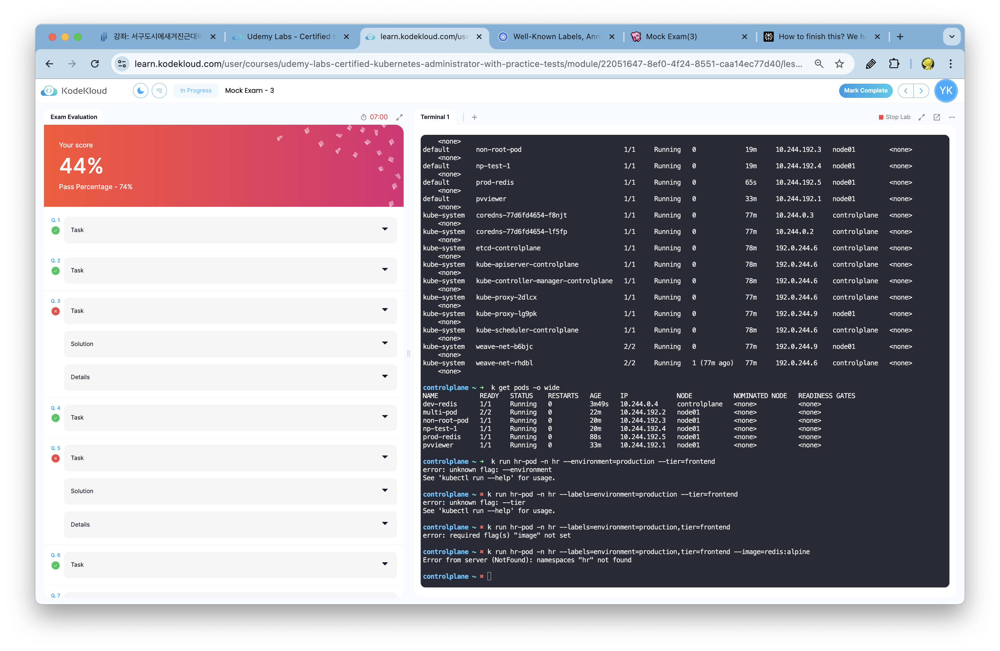

# CKA 시험 준비 D-1
내일 오전 6시에 시험인데 막판에 일이 너무 몰려서 정말 준비가 너무 부족하다. 마음 같아서는 미루고 싶지만 시험 변경이 불가능하고, 25일에 개정되는만큼 해보는데까지 해보려 한다.

Q. Create a new deployment called nginx-deploy, with image nginx:1.16 and 1 replica. Next upgrade the deployment to version 1.17 using rolling update.   
- Deployment : nginx-deploy. Image: nginx:1.16   
- Image: nginx:1.16   
- Task: Upgrade the version of the deployment to 1:17   
- Task: Record the changes for the image upgrade   

A.  
1. Create a deployment with the image nginx:1.16 and 1 replica.  
`k create deployment nginx-deploy --image=nginx:1.16 --replicas=1`

2. Set the image to nginx:1.17.
`k set image deployment/nginx-deploy  nginx=nginx:1.17`

Q. Create a new user called john. Grant him access to the cluster. John should have permission to create, list, get, update and delete pods in the development namespace . The private key exists in the location: /root/CKA/john.key and csr at /root/CKA/john.csr.   

- Important Note: As of kubernetes 1.19, the CertificateSigningRequest object expects a signerName.   
- Please refer the documentation to see an example. The documentation tab is available at the top right of terminal.   
- CSR: john-developer Status:Approved   
- Role Name: developer, namespace: development, Resource: Pods   
- Access: User 'john' has appropriate permissions   

A.  
1. Create a CSR for the user john. `vim csr.yaml`  
   1. Change the crt file into base64 for the csr.yaml file. `cat /root/CKA/john.csr | base64 | tr -d "\n"`  
   2. Create a CSR object for the user john. `k create -f csr.yaml`  
   3. Approve the CSR for the user john. `k certificate approve john-developer`
2. Create a Role 
   1. `kubectl create role developer --verb=create,get,list,delete --resource=pods -n development`
3. Create Role Binding
   1. `kubectl create rolebinding john-developer --role=developer --user=john -n development`
4. [optional] Check
   1. `k auth can-i get pods --namespace=development --as=john`

Q. Create a nginx pod called nginx-resolver using image nginx, expose it internally with a service called nginx-resolver-service. Test that you are able to look up the service and pod names from within the cluster. Use the image: busybox:1.28 for dns lookup. Record results in /root/CKA/nginx.svc and /root/CKA/nginx.pod   

- Pod: nginx-resolver created   
- Service DNS Resolution recorded correctly   
- Pod DNS resolution recorded correctly   

A.  
1. Create a pod called nginx-resolver using image nginx.  
   1. `k run nginx-resolver --image=nginx`
2. Expose the pod internally with a service called nginx-resolver-service.  
   1. `k expose pod nginx-resolver --name=nginx-resolver-service --port=80`
3. Create busybox pod for dns lookup.  
   1. `k run busybox --image=busybox:1.28 -- sleep 4000`
4. Do nslookup for the service and pod names.  
   1. SVC: Enter the busybox pod to nslookup and save it to file. `k exec busybox -- nslookup nginx-resolver-service > /root/CKA/nginx.svc`
   2. POD:  
      1. Get ip address of the nginx-resolver pod. `k get pod nginx-resolver -o wide`
      2. Enter the busybox pod to nslookup and save it to file. `k exec busybox -- nslookup 10-244-192-1.default.pod.cluster.local > /root/CKA/nginx.pod`

Q. Create a static pod on node01 called nginx-critical with image nginx and make sure that it is recreated/restarted automatically in case of a failure.  
- Use /etc/kubernetes/manifests as the Static Pod path for example.

A. 

1. Get the node name. `k get nodes -o wide`
2. Create a dry-run yaml file for the static pod.  
   1. `k run nginx-critical --image=nginx --restart=Always --dry-run=client -o yaml`
3. Create a static pod on node01.
   1. `cat > /etc/kubernetes/manifests/nginx-critical.yaml`

