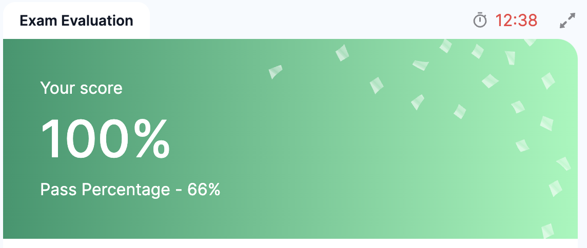
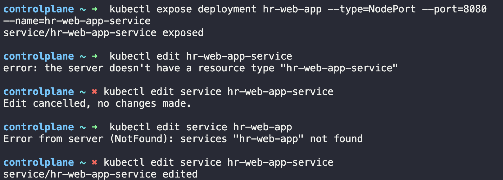

# CKA 시험 준비 6일차
다시 모의고사 복습이다. 두 문제 정도 참고하면서 찾아봤는데 처음으로 100% 맞았다.

## 복기
여전히 저 deployment와 서비스 문제에서 맨날 헤맨다. 

1. Expose the hr-web-app created in the previous task as a service named hr-web-app-service, accessible on port 30082 on the nodes of the cluster.
The web application listens on port 8080.

아 이거 왜 틀린지 알겠다.

`kubectl expose deployment hr-web-app --name=hr-web-app-service --type=NodePort --port=8080`를 해야하는데, `--name=hr-web-app-service`을 빼먹어서 namespace가 정의가 안됐다. 

그래도 PV 문제는 이제 어느 정도 익숙해졌다.

1. Create a Persistent Volume with the given specification: -  

    Volume name: pv-analytics  
    Storage: 100Mi  
    Access mode: ReadWriteMany  
    Host path: /pv/data-analytics  

