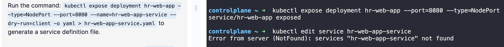
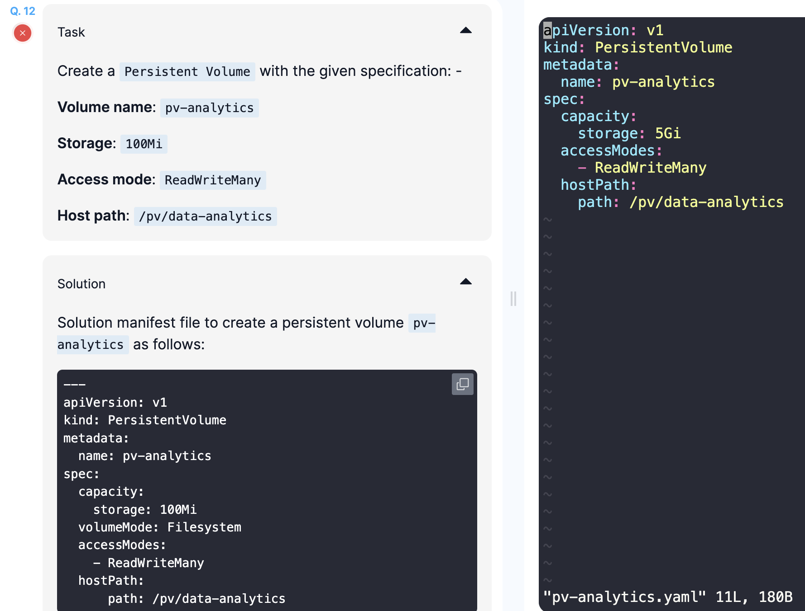

# CKA 시험 준비 4일차
다시 모의고사 복습이다. 그러나 이번에는 처음으로 안 찾아보고 순수히 내 실력과 documentation만으로 풀어보려 한다.

## 복기
처음으로 안 찾아보고 풀어봤다.

두 문제 틀린거 보면 나름 선방했다.

첫번째로 틀린거는 기억이 안나서 스킵한 문제다.

1. Expose the hr-web-app created in the previous task as a service named hr-web-app-service, accessible on port 30082 on the nodes of the cluster.
The web application listens on port 8080.

아 이거 왜 틀린지 알겠다.

`kubectl expose deployment hr-web-app --name=hr-web-app-service --type=NodePort --port=8080`를 해야하는데, `--name=hr-web-app-service`을 빼먹어서 namespace가 정의가 안됐다. 

두번째로 틀린거는 바보같이 documentation의 capacity를 그대로 따라 쳐서 틀린 문제.

2. Create a Persistent Volume with the given specification: -  

    Volume name: pv-analytics  
    Storage: 100Mi  
    Access mode: ReadWriteMany  
    Host path: /pv/data-analytics  

