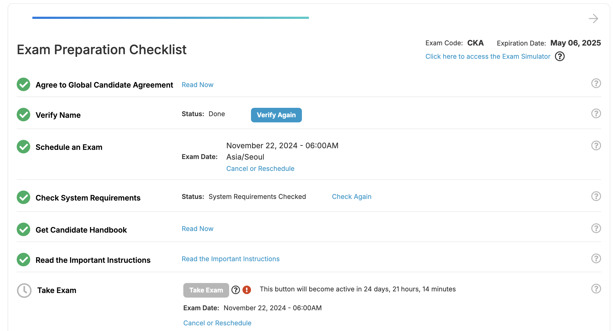
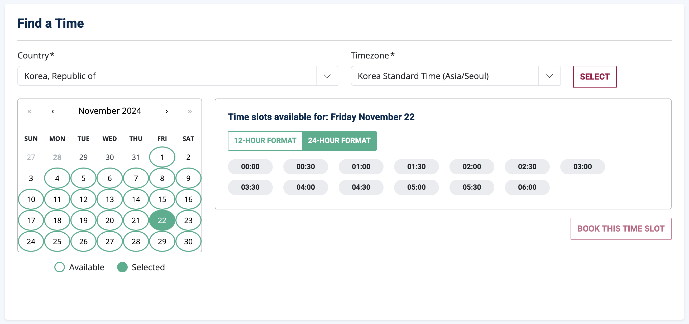
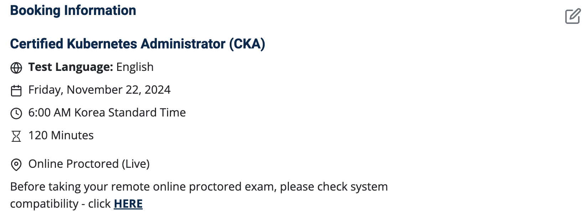
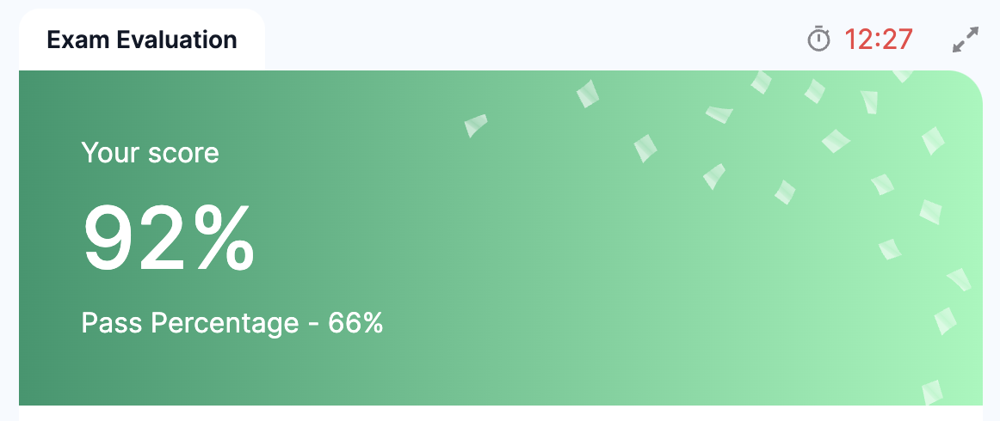

# CKA 시험 준비 1일차
일단 11월 25일에 [CKA가 바뀐다고 한다](https://training.linuxfoundation.org/certified-kubernetes-administrator-cka-program-changes/). 그러면 내용이 어떻게 바뀔지 모르기 때문에 그 전에 최대한 한번 시도해보려고 한다.

각오를 보이기 위해 시험 일정을 잡기로 했다.


시험 시간이 주중에는 새벽에만 가능하다. 어처피 봐야하는거 금요일 오전 6시에 봐야겠다.


정확히 24일 남았다. 일부러 최대한 널널하게 잡았다. 오늘부터 다시 한번씩 매일 시험을 풀어볼 예정이다.


## labs
- https://labs.play-with-k8s.com/ 에서 가벼운 실험들 해볼 수 있다. 


## 팁
자료들 찾아보니까 핵심은 다음 두 가지 같다.
1. 모의고사 익숙해지고 시간 내로 자신 있게 풀 수 있을 때까지 연습
2. alias를 만들어서 자주 사용하는 명령어를 줄여서 사용
3. documentation을 자주 보고 익숙해지기 + 미리 북마크해놓기


## 오늘의 풀이

1. A new application orange is deployed. There is something wrong with it. Identify and fix the issue.

먼저 뭐가 문제인지 진단: `kubectl get pod orange`

보니까 LoopError이 뜨고 있음. 더 자세한 진단 확인: `kubectl describe pod orange`

이때 확인해본 결과:
```
Command:
    sh
    -c
    sleeeep 2;
```
sleep에 오타 발견. 수정하기 위해: `kubectl edit pod orange`

수정을 하니까 오류가 엄청 많이 뜨는데, 아마 실행중인 pod를 수정하려 해서 그런듯. `kubectl delete pod orange`로 삭제하고 다시 yaml파일 생성하여 만들었다.

```yaml
apiVersion: v1
kind: Pod
metadata:
    name: orange
spec:
initContainers:
  - name: init-myservice
    image: busybox
    command:
    - sh
    - -c
    - sleep 2;
  containers:
  - name: orange-container
    image: busybox:1.28
    command:
    - sh
    - -c
    - echo The app is running! && sleep 3600
```

`kubectl apply -f orange.yaml`로 다시 만들어주니까 정상적으로 생성되었다.

## 복기
문제 풀이 채점을 해보니 orange를 제외하고 다 맞았다. orange를 왜 틀렸는지 확인해보니, `kubectl edit pod orange`까진 맞는데, 이때 생성되는 temp파일으로 `kubectl replace -f /tmp/kubectl-edit-xxxx.yaml --force` 이런식으로 적용해줘야 했다.



확실히 어려운 문제가 몇개 섞여있다.

### 자료
- [Zero to CKA in 2 Weeks](https://capgemini.github.io/kubernetes/Zero-to-CKA-in-2-Weeks/)
- [How to Pass the Certified Kubernetes Administrator Exam in 7 Days](https://hackernoon.com/how-to-pass-the-certified-kubernetes-administrator-exam-in-7-days-saw3uhu)
- [CKA-practice-exercises - Github](https://github.com/alijahnas/CKA-practice-exercises?tab=readme-ov-file)