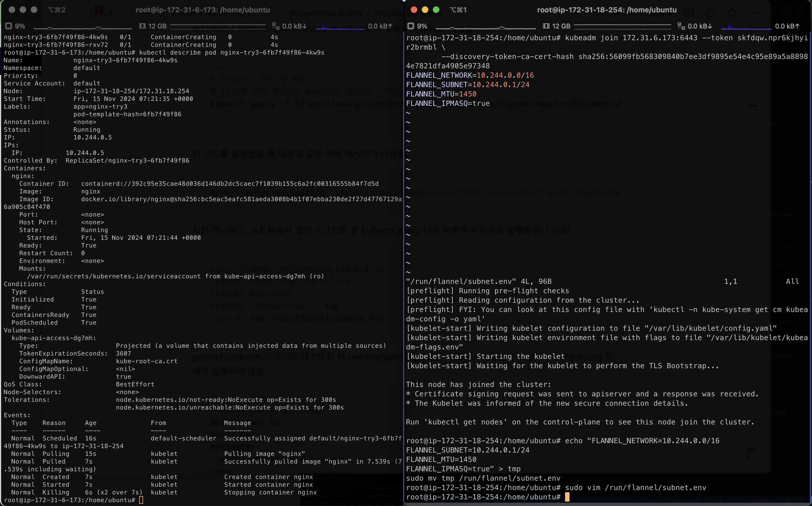
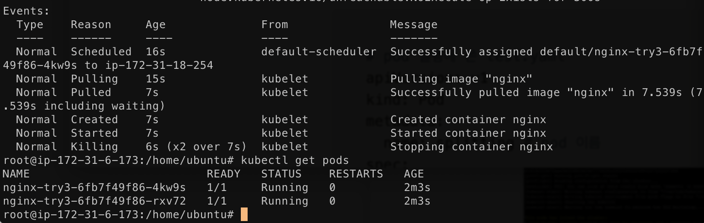

# Kubernetes Cluster 설정을 위한 커맨드

1. Install docker

```bash
sudo su
apt-get update
apt-get install apt-transport-https
apt install docker.io -y
docker --version
systemctl start docker
systemctl enable docker
```

2. Install kubernetes

```bash
echo "deb [signed-by=/etc/apt/keyrings/kubernetes-apt-keyring.gpg] https://pkgs.k8s.io/core:/stable:/v1.28/deb/ /" | sudo tee /etc/apt/sources.list.d/kubernetes.list
curl -fsSL https://pkgs.k8s.io/core:/stable:/v1.28/deb/Release.key | sudo gpg --dearmor -o /etc/apt/keyrings/kubernetes-apt-keyring.gpg
sudo apt update
sudo apt install -y kubelet kubeadm kubectl kubernetes-cni
```

3. Initialize kubernetes cluster on master node

```bash
sudo kubeadm init 
```

4. Install flannel network

```bash
mkdir -p $HOME/.kube
cp -i /etc/kubernetes/admin.conf $HOME/.kube/config
chown $(id -u):$(id -g) $HOME/.kube/config
kubectl apply -f https://raw.githubusercontent.com/coreos/flannel/master/Documentation/kube-flannel.yml

kubectl apply -f https://raw.githubusercontent.com/flannel-io/flannel/v0.22.2/Documentation/k8s-old-manifests/kube-flannel-rbac.yml 
```

5. Join worker nodes to the cluster  
Something like this will have popped up after running `kubeadm init` on the master node. Input it in each worker node.

```bash
kubeadm join 172.31.6.173:6443 --token skfdqw.npr6kjhyir2brmbl \
	--discovery-token-ca-cert-hash sha256:56099fb568309840b7ee3df9895e54e4c95e89a5a88984e7821dfa4905e97348
```

Once that is done, the nodes will appear as ready as below:  


6. Create a deployment

```bash
kubectl create deployment nginx --image=nginx --replicas=2
```


7. Add `/run/flannel/subnet.env` file to each node

```bash
echo "FLANNEL_NETWORK=10.244.0.0/16
FLANNEL_SUBNET=10.244.0.1/24
FLANNEL_MTU=1450
FLANNEL_IPMASQ=true" > tmp
sudo mv tmp /run/flannel/subnet.env
```





# References
- [A Beginner’s Guide to Deploying a Kubernetes Cluster on EC2 Instances with Kubeadm](https://cloudzenia.com/blog/a-beginners-guide-to-deploying-a-kubernetes-cluster-on-ec2-instances-with-kubeadm/)
- [Installing kubernetes on Ubuntu](https://github.com/kubernetes/kubernetes/issues/123673)
