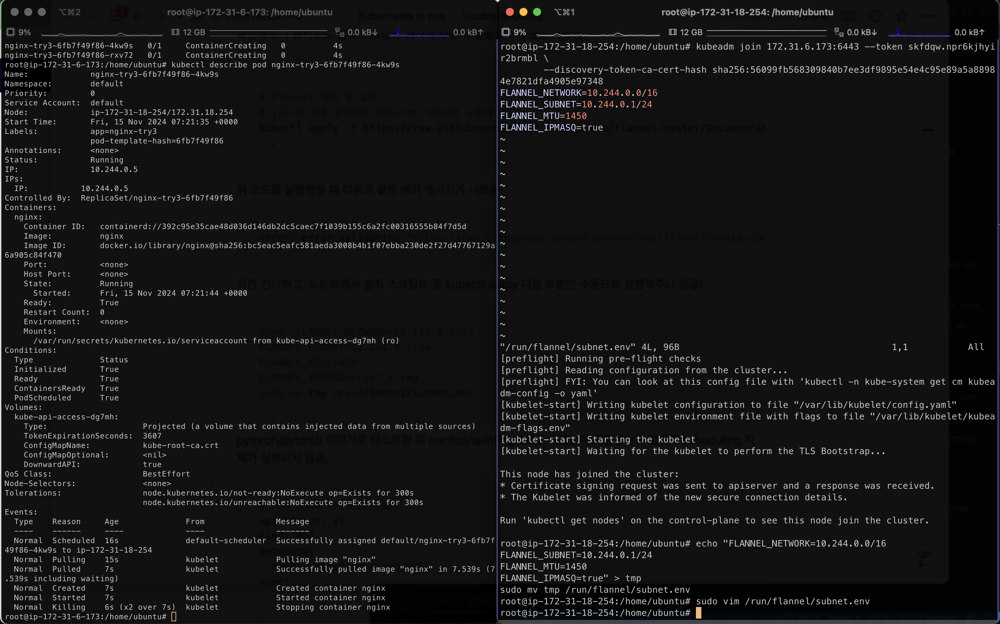
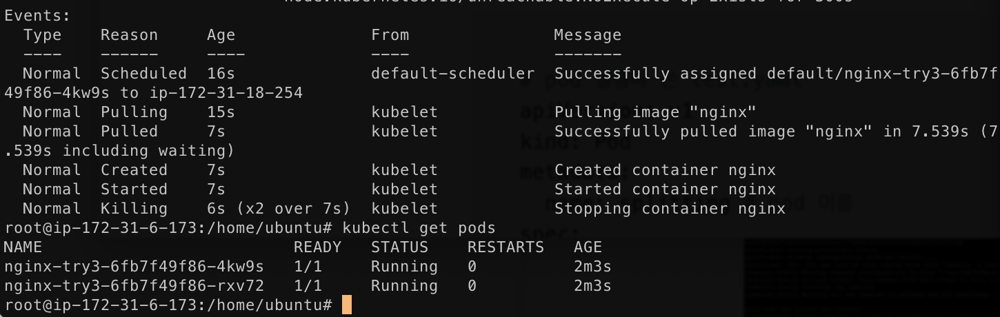
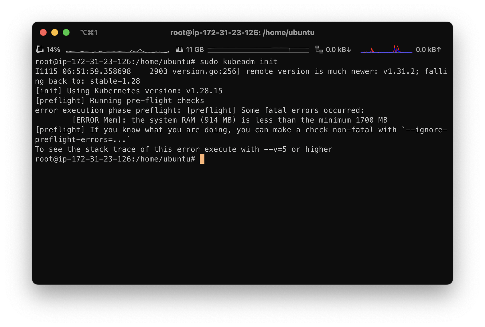
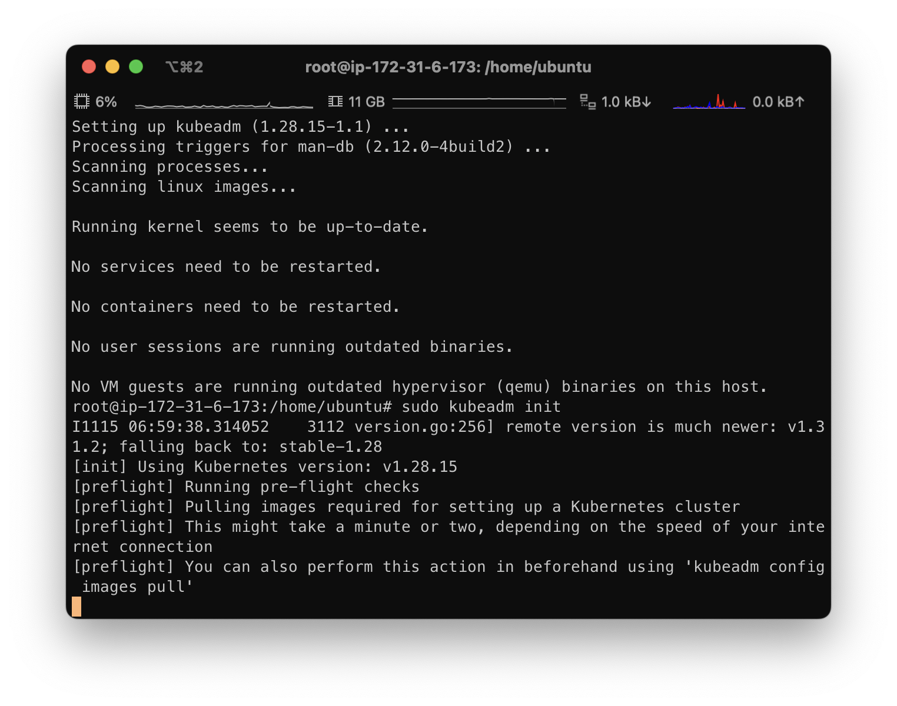

# [ERROR Flannel]: loadFlannelSubnetEnv failed: open /run/flannel/subnet.env: no such file or directory

```bash
Failed to create pod sandbox: rpc error: code = Unknown desc = failed to setup network for sandbox "[sandbox_id]": plugin type="flannel" failed (add): loadFlannelSubnetEnv failed: open /run/flannel/subnet.env: no such file or directory
```

진짜 오래 애먹은 문제다. 이 문제는 flannel이 `/run/flannel/subnet.env` 파일을 찾지 못해서 발생한다.

이를 모든 노드에 직접 생성해주면 된다.

```bash
echo "FLANNEL_NETWORK=10.244.0.0/16
FLANNEL_SUBNET=10.244.0.1/24
FLANNEL_MTU=1450
FLANNEL_IPMASQ=true" > tmp
sudo mv tmp /run/flannel/subnet.env
```





## [ERROR Mem]: the system RAM (914 MB) is less than the minimum 1700 MB

저장공간이 부족한 경우다. EC2를 micro로 생성했을 때, 이런 에러가 발생한다. 




t2.medium으로 바꿔주니까 해결된다. 역시 RAM 관련으로 뭔가 안되면 리소스를 늘려주는게 답이다.




# References
- [A Beginner’s Guide to Deploying a Kubernetes Cluster on EC2 Instances with Kubeadm](https://cloudzenia.com/blog/a-beginners-guide-to-deploying-a-kubernetes-cluster-on-ec2-instances-with-kubeadm/)
- [Installing kubernetes on Ubuntu](https://github.com/kubernetes/kubernetes/issues/123673)