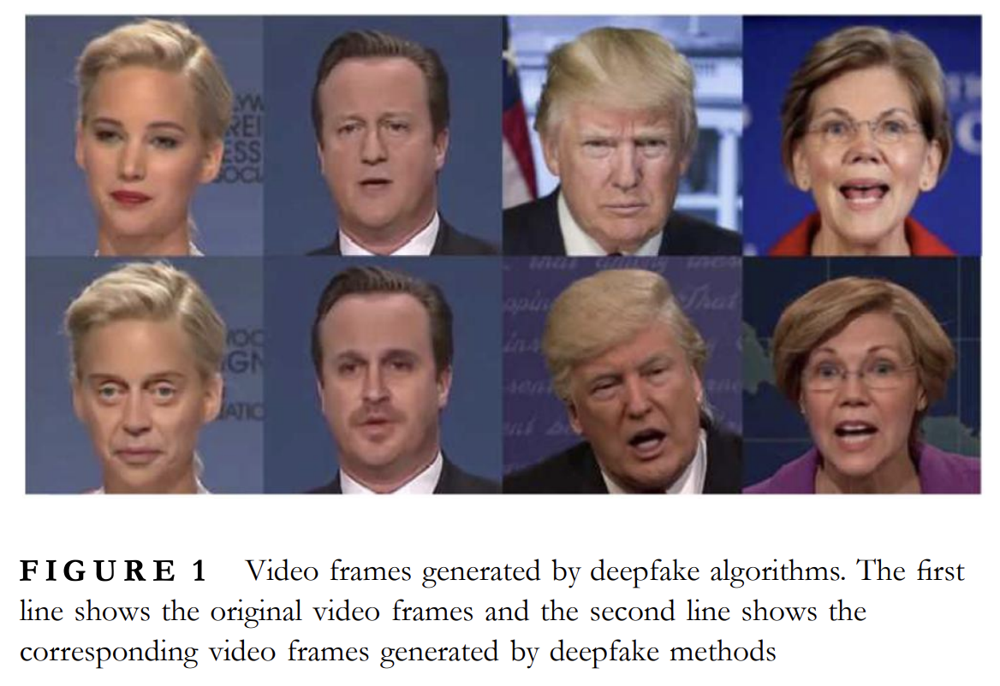
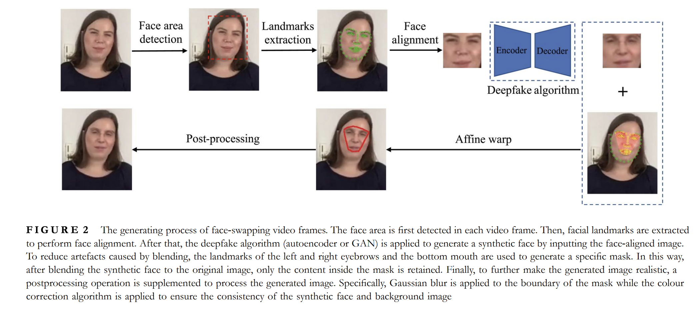
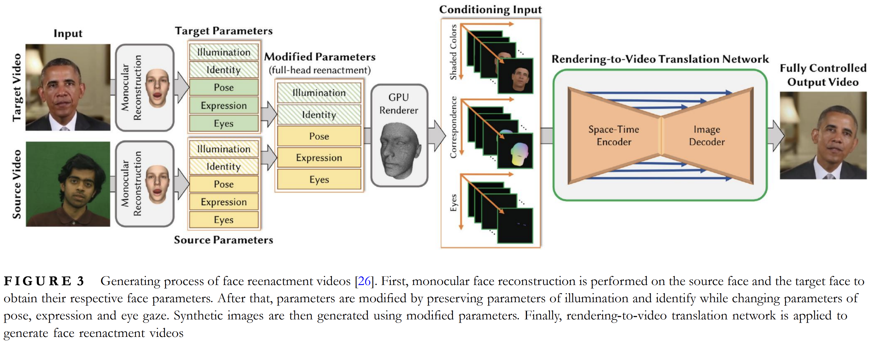
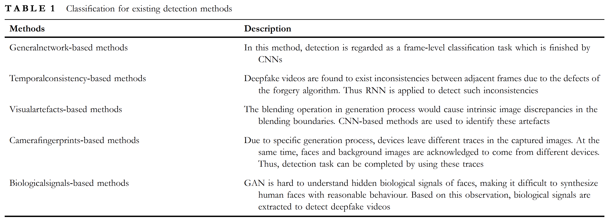
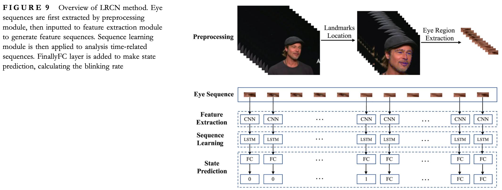
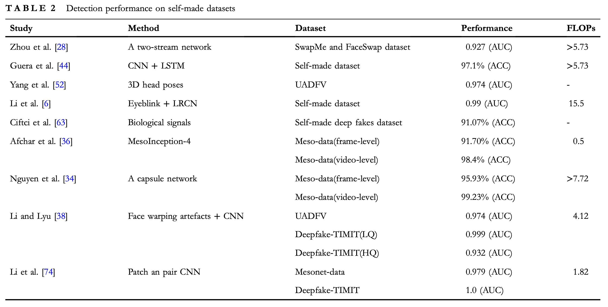

# Abstract

딥러닝 알고리즘을 통해 생성되고 있는 딥페이크 기술이 발전하면서 유명인사 또는 정치인을 대상으로 하는 악성 영상 딥페이크가 생성되는 일이 많아졌습니다. 
해당 survey 페이퍼에서는 이런 일을 방지하기 위해 개발된 방벌들과 벤치마크를 소개합니다.

# 1. Introduction

딥러닝 알고리즘들은 autoencoder 또는 GAN을 활용하여 얼굴만 대체하는 딥페이크 영상 생성이 가능해졌습니다. 데이터가 많다는 가정하에, 이를 생성하는 것은 간단한 일입니다.

딥페이크 기술이 영화산업 또는 VR에 활용되는 가능성은 열렸으나, 실질적으로는 유명인사 또는 정치인을 대상으로 하는 악성 영상 딥페이크가 생성되는 일이 많아졌으며, 이를 간단하게 생성하는 보급화 앱들도 등장하여 큰 화제가 되었습니다.

이에 따라 더욱 많은 탐지 연구 또한 진행되었습니다. 예시로, DeepFake-TIMIT, UADFV 등의 탐지용 데이터셋이 등장했습니다.

많은 발전이 있었으나 계속하여 생기는 딥페이크 생성 기술들으로 인하여, 탐지 기술이 더 이상 적절한 해결책이 되지 못하는 경우가 많습니다.

# 2. Deepfake Video Generation
새로 등장하는 딥페이크 알고리즘들은 대부분 generative network 기반이며, 악용되어 피해를 주는 경우가 많습니다. 대표적인 방법들은 다음과 같습니다.

## 2.1 Development of deepfake technologies
현대의 딥페이크 기술은 두 분야로 나뉩니다: face swapping과 face reenactment입니다. 

### 2.1.1 Face swapping
Face swapping은 두 영상의 얼굴을 교체하는 방법입니다.  

- 2017년에 CNN 기반의 딥페이크 기술으로 사진에서의 얼굴을 교체하는 방법이 등장하였으나, time continuity 문제로 영상에서의 얼굴 교체는 어려웠습니다. (Korshunova et al., 2017)
- 2017년에 하나의 이미지와 하나의 비디오로부터 generative network를 사용하여 새롭게 랜더링된 얼굴은 영상 얼굴 위에다 덧붙여지는 방법이 등장하였습니다. (Olszewski et al., 2017)
- 2017년 겨울에 최초의 딥페이크 영상이 등장하면서 화제가 되어 많은 face-swap 영상들과 프레임워크들이 등장하였습니다.
- 2019년에는 autoencoder에 adversarial loss와 perceptual loss를 추가하여 생성된 딥페이크 영상이 더욱 자연스러워졌습니다. (VGGFace, 2019)
- 최근에는 FaceShifter로 과거 제한된 정보로만 얼굴을 생성하던 것을 얼굴 attribute을 통해 high-fidelity face swapping이 가능해졌습니다. (FaceShifter, 2020).
- 특히, AEI-Net과 HEAR-Net을 사용하여 얼굴 정보와 anomaly region을 보완합니다.

### 2.1.2 Face reenactment
반면에 Face reenactment는 영상에서 사람들의 표정을 바꾸는 방법입니다.

- 최초의 face reenactment는 2006년 Vlasic et al.에 의해 제안되었습니다.
- 2016년에는 Face2Face에서 monocular facial reenactment를 제안. 해당 연구에서는 model-based bundling 방법을 통해 목표와 입력 얼굴 간의 표정 전환이 가능했습니다. (Thies et al., 2016)
- 입 주변의 표정을 생성하기 위해 새로운 방법을 제안했으나 아직 부족했습니다.
- 2017년에는 해당 단점을 보완하기 위해 audio-to-video mapping을 해서 인물들이 영상 내용과 같은 대사를 말하도록 하는 연구가 등장했습니다. 음성 시쿼스 feature들이 RNN의 인풋으로 들어가고, output으로 입모양을 출력했습니다.(Suwajanakorn et al., 2017)
- 이후 Fried et al.은 neural face rendering 기법으로 개선을 했습니다. (Fried et al., 2019)
- 2018년에는 space-time 아키텍처를 사용하여 face rendering을 full photo-realistic 영상을 만드는데 성공했습니다. (Kim et al., 2018)
- 특히, Face2Face와 비교했을 때, 이는 눈 깜빡임, 머리 움직임, 시선처리 등을 더욱 자연스럽게 처리할 수 있었습니다.

## 2.2 General process of deepfake video generation
딥페이크 영상 유형 두가지에 대한 생성 방법을 소개합니다.

### 2.2.1 Face swapping

- 딥페이크 알고리즘: 얼굴 표정을 유지하되, 다른 사람의 얼굴로 교체하는 부분.
- 대부분 data reconstruction에 쓰이는 autoencoder 기반
  - encoder: 이미지의 latent feature 추출
  - decoder: latent feature를 이미지로 복원
- 원본과 목표 얼굴들의 공통된 feature를 추출하여, 이를 통해 얼굴을 복원합니다.
- 디코더 A는 얼굴 A로만 학습되며, 디코더 B는 얼굴 B로만 학습됩니다.
- 이후, 학습이 다 끝난 뒤 A의 얼굴 이미지를 디코더 B로 넘기면, B의 얼굴을 A의 얼굴으로 복원하려 합니다. 즉, A의 표정을 유지하되, B의 얼굴로 교체하는 것입니다.

# 3. Detection Approaches
초기 딥페이크 영상 탐지에는 불규칙적인 얼굴 synthesis feature를 탐지했으며, 최근 방법은 주로 fundamental features를 탐지합니다.

1. frame-level classification task. CNN 기반.
2. RNN을 적용하여 frame 간의 불규칙성 탐지.
3. 이미지 생성 과정 중, blending boundary 불규칙성을 CNN으로 탐지.
4. 이미지가 찍힐 경우 카메라의 특성이 사진에 나타나는 점을 활용하여 탐지.
5. GAN이 사람의 생체 특성을 이해하기 어려워한다는 점을 활용하여 불규칙적인 특성을 탐지.

## 3.1 General-network-based methods
Image classification 기법들이 딥페이크 영상 탐지 성능을 개선하는데 쓰입니다. 이런 방법에서는 영상에서 얼굴을 추출하고, 이를 detection network를 학습 시키는데 사용합니다. 이후, 이렇게 학습된 모델으로 영상의 모든 프레임을 탐지합니다. 마지막으로 이렇게 탐지된 프레임 예상치들을 평균값을 구하거나 voting을 통해 최종 결과를 도출합니다. 해당 방법론은 두가지로 나뉩니다: transfer learning 기반과 specially designed network 기반입니다.

### 3.1.1 Transfer learning
최초의 딥페이크 탐지 알고리즘들은 흔히 사진분류 기반이었습니다.
- (Zhou et al., 2017)는 two-stream network로 얼굴 탐지
- (Rossler et al., 2019)는 Xception network로 얼굴 탐지
- 이외에도 비슷하게 DFDC, 등이 있으며 가장 성능 좋은 XceptionNet은 93% 성능도 보임.
- 그러나, 이런 방법들은 overfitting 문제가 있으며, preprocessing으로 진짜와 가짜 영상 간의 근본적인 차이를 잡아재려고 했습니다.

### 3.1.2 Specially designed network
대규모 데이터셋의 등장으로 탐지 알고리즘의 generalization(일반화)에 대한 요구가 높아졌습니다. 

- (Nguyen et al., 2019)는 detection network의 성능 개선을 위하여 capsule network를 사용했습니다. 이때, 얼굴 이미지들이 VGG-19 network로 입력되어 추출된 feature들이 capsule network로 들어가게 됩니다. 그러나, 이전에 보지 못했던 딥페이크 영상에 대해서는 성능이 최악이었으며, 이는 capsule network의 generalization 능력이 부족했기 때문입니다.
- (Afchar et al. 2018)에서도 CNN인 MesoInception-4를 제안하여 이미지의 중시적 특성 (mesoscopic: micro-와 macro- 사이)을 탐지합니다. 이는 딥페이크 영상에서 나타나는 불규칙적인 특성을 탐지하는데 사용됩니다. 이는 많은 데이터셋에서 좋은 성능을 보였습니다. 그러나 왜 성능이 잘 나왔는지는 아직도 불명확합니다.

### 3.1.3 Summary
- transfer learning: overfitting 문제가 있습니다. 딥페이크 탐지에는 아쉬운 성능을 보여서 방향이 변화하고 있습니다.
- 많은 새로운 network들은 multitask learning을 적용하기 시작했으며, 픽셀 단위로 마스크 조작을 탐지하려 합니다.
- Nguyen이 semi-supervised learning 프레임워크를 사용해봤으나, supervised multitask learning은 최종적인 성능은 개선하지 못했습니다.
- 이후, attention을 통해 더욱 성능을 개선하려 했으며, Dang et al.의 attention mechanism은 특히나 성능이 좋았습니다.

## 3.2 Temporal-consistency based methods
사진과는 다르게 영상은 여러 프레임으로 이루어져 있으므로, 프레임들이 조작되면 이들 간의 불규칙성이 생깁니다. 특히, 얼굴 위치와 영상 깜빡임 현상이 발생합니다. 이런 현상들을 탐지하는 방법을 CNN-RNN 아키텍처부터 시작해서 다양한 방법들을 소개합니다.

### 3.2.1 CNN-RNN
- 영상의 시간 연속성을 고려하여 RNN을 사용하여 딥페이크 영상을 탐지하려 했습니다.
- 이때, 생성된 얼굴들은 frame 단위로 생성되기 때문에 autoencoder는 이전에 생성된 얼굴들을 알 수가 없었으며, temporal locality가 존재하지 않았습니다.
- 따라서, 다수의 anomality를 인지하고 딥페이크 영상이라고 탐지할 수 있었습니다.
- 인접한 프레임 간의 연속성을 확인하기 위해 LSTM 구조의 프레임 단위 분석 시스템이 제안되었습니다. 
- 이때, CNN이 frame feature extraction을 담당하고, LSTM이 temporal sequence analysis를 담당합니다.
- 이렇게 제작한 알고리즘은 영상 길이가 2초 미만이어도 정확하게 탐지할 수 있다고 합니다. (Guera et al., 2018)

### 3.2.2 Improvement
Guera 때만 해도 대규모 데이터셋들이 적어서 효과를 증명하기 힘들었지만, 이로부터 영감을 받은 연구는 많았습니다.

- (Sabir et al., 2019)는 영상의 연속성 정보를 통해 비슷한 시스템을 구축하고 마지막에 CNN을 follow-up training에 사용했습니다.
- 그러나 이런 방법들은 고화질 영상들에 대해서는 성능이 좋으나, 저화질 영상들에 대해서는 성능이 좋지 않았습니다. 인접 프레임 간의 연속성이 영상의 압축 과정으로부터 방해받기 때문입니다.
- 이를 해결하기 위해 (Montserrat et al., 2019)는 automatic weighing mechanism을 사용하여, 가장 믿을만한 구간들에 가중치를 더 주었습니다.
- 실험들으로부터 CNN과 RNN을 합칠 경우 DFDC 데이터셋에 높은 성능을 보였습니다.
- (Zhao et al., 2019)는 optical flow를 사용하여 인접 프레임간 과한 차이점을 탐지했으나, generalization에서는 성능이 좋지 않았습니다.
- 이를 해결하기 위해, (Wu et al., 2020)는 SSTNet을 제안하여, low-level artefacts와 temporal discrepancies 모두 탐지하도록 했습니다.

### 3.2.3 Summary
일반적인 network-based 방법과는 다르게 temporal-consistency based 방법은 영상의 시간적 특성을 고려하여 탐지하여 성능을 개선합니다. 그러나, 많은 모델들은 원본 프레임의 연속성을 추출하는 과정에서 시공간적 특성을 붕괴시키는 문제가 있습니다. CNN-RNN 아키텍처들은 프레임 간의 feature를 벡터화 시키기 때문에 시간적 일관성을 판단할 때에 있어서 공간적 feature 특성을 잃어버립니다. 3DCNN 등의 구조가 spatial feature를 보존할수는 있지만, parameter가 너무 많아서 오버피팅 문제가 발생하기 쉽습니다.

## 3.3 Visualartefacts based methods
대부분의 딥페이크 영상 생성 과정에서 generated face를 배경에다 덧씌우는 방식이라, 두개 간 경계에서 불규칙성이 발생합니다. 이런 불규칙성을 탐지하는 방법론을 소개합니다.

### 3.3.1 Face warping artefacts
- (Li et al., 2018)는 딥페이크 영상에서 face warping artefacts를 통해 배경과 얼굴의 경계가 부자연스러운 점을 이용해 탐지합니다.
  
### 3.3.2 Blending boundary
- (Li et al., 2018)에서는 Face X-ray를 제안하여 얼굴과 배경 간의 경계선을 정의하고 이를 통해 generalization은 가져갔으나, 과하게 경계선만 탐지하기 때문에 fully synthesized images에 대해서는 성능이 떨어졌습니다.

### 3.3.3 Head Pose Inconsistency
- 또다른 연구는 (Yang, 2019) 머리의 각도와 얼굴의 각도가 일치하지 않는 경우를 탐지합니다. 다만, 데이터셋을 자체 제작하고 상대적으로 기초적인 딥페이크 알고리즘 탐지를 기반으로 하여 최근 딥페이크 알고리즘들 상대로는 성능이 좋지 않습니다.

### 3.3.4 Summary
따라서, Visual-artefacts을 활용한 방법들이 더 generalizable했으나, 지나치게 한 가지 특성에 의존하는 경우가 많아서 딥페이크 알고리즘들이 발달하면서 연구가 줄어들고 있는 추세지만, 그럼에도 불구하고 성능은 잘 나온다. Intrinsic feature를 찾는 연구가 더 많아지고 있다.

## 3.4 Camera-fingerprints-based methods
카메라 지문이란 사진에 남는 기기 특유의 노이즈를 지칭합니다. 이는 총 3개 종류: Photo Response Non-Uniformity(PRNU), Noiseprint, 그리고 Recent video noise pattern 등이 있습니다.

### 3.4.1 PRNU
기기마다 사진을 찍을 떄 발생하는 차이들 때문에, 기기 고유의 노이즈가 있습니다. 이를 PRNU라 지칭하고, 실리콘 웨이퍼로 인한 빛의 굴곡이 이를 발생시킵니다. 이를 통해 딥페이크 영상을 탐지할 수 있습니다.

### 3.4.2 Noiseprint
카메라 기계 특징 이외에도 사진을 저장하면서 발생하는 변환 또한 노이즈 패턴을 만듭니다. 예시로, interpolation과 gamma correction이 있습니다. 

### 3.4.3 Video noise pattern
(Cozzolino, 2019)는 Noiseprint를 통해 출처 확인 뿐만 아니라, 배경의 noiseprint와 인물의 noiseprint 차이로 딥페이크 탐지를 시도했습니다. 이미지를 프레임 단위로 쪼갠 뒤, 배경과 이미지의 noiseprint를 비교하여 딥페이크 영상을 탐지합니다. 이는 FaceForensic++ 데이터셋에서 좋은 성능을 보였습니다.

### 3.4.4 Summary
카메라 지문을 활용한 방법들은 딥페이크 영상 탐지에 있어서 높은 성능을 보이고 있습니다. 그러나, 이 방법을 사용하려면 여러 카메라로 찍은 데이터셋이 필요하며, 등록되어 있지 않은 카메라에 대한 사진은 성능이 떨어질 것입니다. GAN으로 생성된 영상들은 카메라 지문이 없기 때문에 탐지가 잘 되지만, 이런 지문 또한 생성하는 연구가 진행되고 있기 때문에 이 방법 또한 한계가 있습니다.

## 3.5 Biological signals-based methods
GAN이 사람 얼굴은 정밀하게 묘사 및 생성이 가능하지만, 생체 신호는 아직 재현하기 어렵다는 결과가 있습니다. 이런 현상을 이용하여 생체 신호를 통해 딥페이크 영상을 탐지하는 방법론을 소개합니다.

### 3.5.1 Eye blinking
많은 딥페이크 알고리즘들은 사진 데이터 기반으로 학습되기 때문에, 눈이 깜빡이고 있는 상태 또는 닫고 있는 상태의 데이터가 부족합니다. 따라서, 눈 깜빡임을 탐지하여 딥페이크 영상을 탐지하는 방법론이 있습니다. 이는 long-term reccurrent CNN(LRCN)을 통해 구현이 되었으며, 떠있는 눈과 감은 눈을 구분하여 딥페이크 영상을 탐지합니다. 그러나, 이런 기법은 데이터셋에 감은 눈을 대량 추가하면 파홰될 수 있기 때문에 더 이상 사용되지 않고 있습니다.

### 3.5.2 Heartbeat
(FakeCatcher 2019)는 심박에 따라 혈색이 바뀌는 특성이 활용하여 딥페이크 영상을 탐지합니다. 이런 분야는 remote photoplethysmography(rPPG)라 불리며, 딥페이크에서는 이런 자연스러운 혈류 변화가 없기 때문에 딥페이크 영상을 탐지할 수 있습니다. 이렇게 학습된 모델은 저화질에서든 고화질에서든 좋은 성능을 보였습니다. 이외에도 최근에는 DeepRhythm과 DeepFakesON-Phys 등이 있습니다.

### 3.5.3 Summary
생체 신호를 활용한 방법들은 딥페이크 영상 탐지에 있어서 높은 성능을 보이고 있으나, end-to-end로 하기에는 어렵다고 합니다. 

# 4. Datasets and Performance Evaluation

# Discussion on SOTA
최근에 딥페이크 탐지에 많은 관심이 생겼으나, DFDC 대회에서도 최고 탐지 성능이 65% 밖에 안 나오는 것을 보아 연구가 더 필요한 분야입니다. 

또한, FLOPs 대비 성능이 오르는것을 보아 더욱 효과적인 방법이 있을것이라고 예상합니다.

# Conclusion
최근에 딥페이크 기술을 악용하는 사례가 많아지면서 빅테크와 학계로부터 많은 관심을 받기 시작했습니다. 처음에는 딥페이크 영상 생성 기술들을 소개하며, 이후 이를 탐지하기 위한 방법론들을 소개했습니다. 마지막으로 탐지 방법들에 대한 아쉬운 점들으로 Generalization과 Robustness를 중점적으로 다루었습니다.

# References
- [A Survey on Deepfake Video Detection, Yu 2020](https://ietresearch.onlinelibrary.wiley.com/doi/epdf/10.1049/bme2.12031)